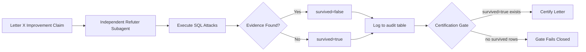

# ULTRALOOP Audit Infrastructure - Brevard & Duval Gold Standard Session

**Created:** 2026-06-12 | **Counties:** brevard, duval | **Session Type:** Gold Standard Autopilot | **Protocol:** ULTRALOOP verification per SSOT

## Session Context & Metrics

### Target Counties & Current Status
```yaml
brevard:
  status: A✓ H✓ | B 134.1% ANOMALY | C 20.8 | D 33.2 | E 78.6 | F 51.1 | G 48.9 | I 18.6 | J 0.0
  sprint_priority: [C/D, J, G, B]  # C/D root cause → J generator → G hitlist → B reconciliation
  critical_anomaly: B=134.1% (>100% ratio auto-fail, requires refutation)

duval:
  status: A✓ H✓ | B 110.2% ANOMALY | C 16.1 | D 52.9 | E 83.4 | F 63.3 | G null | I null | J 0.0  
  sprint_priority: [G/I, C/D, J, B]  # G/I null-fix → C/D root cause → J generator → B reconciliation
  critical_anomaly: B=110.2% (>100% ratio auto-fail, requires refutation)
```

## 1. Verification Workflow Structure

### 1.1 Per-Letter Audit Workflows
Location: `.claude/workflows/ultraloop/`

```yaml
workflow_structure:
  brevard/
    - letter_b_refuter.md     # Refute B=134.1% anomaly with live queries
    - letter_c_verifier.md    # Verify C 20.8→?? improvement claims
    - letter_d_verifier.md    # Verify D 33.2→?? improvement claims  
    - letter_g_verifier.md    # Verify G 48.9→?? improvement claims
    - letter_i_verifier.md    # Verify I 18.6→?? improvement claims
    - letter_j_verifier.md    # Verify J 0.0→?? generation claims

  duval/
    - letter_b_refuter.md     # Refute B=110.2% anomaly with live queries
    - letter_c_verifier.md    # Verify C 16.1→?? improvement claims
    - letter_d_verifier.md    # Verify D 52.9→?? improvement claims
    - letter_g_verifier.md    # Verify G null→?? fix claims
    - letter_i_verifier.md    # Verify I null→?? fix claims  
    - letter_j_verifier.md    # Verify J 0.0→?? generation claims
```

### 1.2 Adversarial Refuter Protocol
Per ULTRALOOP SSOT, every "letter moved/passed" claim gets an independent refuter whose ONLY goal is to break it.

```yaml
refuter_mission:
  goal: "Break the claim with evidence"
  approach: "Find denominator mismatch, double-count, ghost-success, stale source"
  survival_criteria: "Claim passes ONLY if refutation attempts fail"
  evidence_requirement: "SQL query contradicting claim + paste-in results"
  anomaly_auto_fail: "Any metric >100% auto-fails without survival vote needed"
```

## 2. Evidence Collection Framework

### 2.1 VERIFIED Claims Requirements
Per Honesty Protocol V3, all claims must carry evidence tags:

```yaml
evidence_tags:
  VERIFIED: "Proof attached (SQL output, DB query result, test execution)"
  UNTESTED: "Not tested yet — zero penalty, always acceptable" 
  INFERRED: "Guessing from context — must include 1-sentence evidence"

sql_verification_mandatory:
  - Letter improvement claims (C 20.8→X, D 33.2→Y, etc)
  - Anomaly resolution claims (B 134.1%→≤100%)
  - Null-fix claims (G null→value, I null→value)
  - Generator success (J 0.0→≥95%)
  - Live table counts for all assertions
```

### 2.2 Evidence Collection Commands
```sql
-- B Letter Anomaly Verification (brevard)
SELECT 
    COUNT(*) as total_closed_auctions,
    COUNT(CASE WHEN verified_outcome_source != 'derived' THEN 1 END) as independent_verified,
    ROUND(100.0 * COUNT(CASE WHEN verified_outcome_source != 'derived' THEN 1 END) / COUNT(*), 1) as percentage
FROM multi_county_auctions 
WHERE county_slug = 'brevard' 
  AND auction_status = 'closed'
  AND created_at >= '2026-06-01';

-- C Letter Parity Clean Verification  
SELECT 
    COUNT(*) as total_auctions,
    COUNT(CASE WHEN parity_status = 'clean' THEN 1 END) as clean_matches,
    ROUND(100.0 * COUNT(CASE WHEN parity_status = 'clean' THEN 1 END) / COUNT(*), 1) as percentage
FROM multi_county_auctions
WHERE county_slug = 'brevard'
  AND auction_date >= CURRENT_DATE - INTERVAL '90 days';

-- J Letter Generation Verification
SELECT 
    COUNT(*) as total_auctions,
    COUNT(CASE WHEN bid_decisions.id IS NOT NULL THEN 1 END) as with_thesis,
    ROUND(100.0 * COUNT(CASE WHEN bid_decisions.id IS NOT NULL THEN 1 END) / COUNT(*), 1) as percentage  
FROM multi_county_auctions mca
LEFT JOIN bid_decisions bd ON mca.id = bd.auction_id
WHERE mca.county_slug = 'brevard'
  AND mca.auction_date >= CURRENT_DATE - INTERVAL '30 days';
```

## 3. Survival Vote Structure

### 3.1 Claim Lifecycle


### 3.2 gold_standard_ultraloop_audit Table Design
```sql
-- Table structure for audit evidence
CREATE TABLE IF NOT EXISTS public.gold_standard_ultraloop_audit (
    id SERIAL PRIMARY KEY,
    dispatch_id TEXT, -- References the session/summit ID
    ultraloop_mode TEXT CHECK (ultraloop_mode IN ('native', 'fallback')),
    county_slug TEXT NOT NULL,
    letter CHAR(1) CHECK (letter IN ('A','B','C','D','E','F','G','H','I','J')),
    claim TEXT NOT NULL,
    refuter_evidence JSONB, -- What was attacked, queries run, results
    survived BOOLEAN NOT NULL,
    created_at TIMESTAMP WITH TIME ZONE DEFAULT NOW()
);

-- Indexes for certification gate queries
CREATE INDEX IF NOT EXISTS idx_ultraloop_audit_survival 
    ON gold_standard_ultraloop_audit(county_slug, letter, survived, created_at);
```

## 4. Sprint Priority Workflows

### 4.1 Brevard Sprint Order: C/D→J→G→B

```yaml
phase_1_cd_root_cause:
  targets: [letter_c, letter_d]
  refuter_focus: 
    - "Verify parity improvement via live PropertyOnion comparison"
    - "Attack denominators: are we counting the right auction universe?"
    - "Check for stale cache: when was litmus source last updated?"
  sql_attacks:
    - Compare our auction count vs PropertyOnion for same date range
    - Verify parity_status field accuracy with spot-check queries
    - Check for ghost matches (our side shows match, PO side missing)

phase_2_j_generator:
  targets: [letter_j] 
  refuter_focus:
    - "Verify bid_decisions rows actually contain full thesis per definition"
    - "Attack completeness: are we counting partial thesis as complete?"
    - "Check ML pipeline: are Shapira scores actually computed?"
  sql_attacks:
    - Verify bid_decisions.distress_triangle IS NOT NULL
    - Verify bid_decisions.cma_distressed IS NOT NULL AND cma_resale IS NOT NULL  
    - Check ml_score computation vs auction count

phase_3_g_hitlist:
  targets: [letter_g]
  refuter_focus:
    - "Verify zoning coverage claims via live parcel queries"
    - "Attack the weakest dimension rule: density/FAR/parking minimum"  
    - "Check for circular logic: are we backfilling then measuring backfill?"
  sql_attacks:
    - Query actual density/FAR/parking coverage by jurisdiction
    - Spot-check zoning_districts for newly populated data
    - Verify zone_standards coverage for applicable zones

phase_4_b_reconciliation:
  targets: [letter_b]
  refuter_focus:
    - "ANOMALY AUTO-FAIL: B=134.1% mathematically impossible"
    - "Attack the denominator: what are we dividing by?"
    - "Check for double-counting in verified_outcome_source logic"
  sql_attacks:
    - Raw count query: verified outcomes vs total closed auctions
    - Verify no auction counted twice in different outcome categories
    - Check data_source field for PropertyOnion contamination
```

### 4.2 Duval Sprint Order: G/I→C/D→J→B

```yaml
phase_1_gi_null_fix:
  targets: [letter_g, letter_i]
  refuter_focus:
    - "Verify null→value transitions are real, not display fixes"
    - "Attack data source: are we populating from reliable sources?"
    - "Check for cosmetic fixes that don't address root cause"
  sql_attacks:
    - Query zoning coverage before/after for Duval parcels
    - Verify property card rendering completeness
    - Check for placeholder/default values masquerading as real data

# Phases 2-4 follow same pattern as Brevard with duval county_slug
```

## 5. Certification Gate Protocol

### 5.1 Gate Requirements
```yaml
certification_gate:
  rule: "gold_standard_certify MUST find ≥1 row with survived=true for each letter certified"
  lookback: "Newer than letter's last metric change"  
  failure_mode: "Zero rows = gate fails closed (BLANK > WRONG)"
  anomaly_override: "Letters with metrics >100% auto-fail regardless of survival votes"
```

### 5.2 Gate Query Template
```sql
-- Certification gate check for letter X in county Y
SELECT COUNT(*) as survived_audits
FROM gold_standard_ultraloop_audit
WHERE county_slug = '{county}'
  AND letter = '{letter}'
  AND survived = true
  AND created_at > (
    SELECT COALESCE(last_metric_change, '2026-06-01'::timestamp) 
    FROM gold_standard_county_status 
    WHERE county_slug = '{county}'
  );
-- Result must be > 0 for certification to proceed
```

## 6. Execution Plan

### 6.1 Session Structure
```yaml
session_flow:
  1_infrastructure_setup:
    - Create .claude/workflows/ultraloop/ directory
    - Generate workflow templates for each letter per county
    - Initialize gold_standard_ultraloop_audit table
    - Test SQL verification queries

  2_priority_execution:
    brevard: [C/D, J, G, B]
    duval: [G/I, C/D, J, B]
    per_letter:
      - Execute improvement script
      - Run independent refuter workflow  
      - Collect evidence in audit table
      - Determine survival status

  3_certification_gate:
    - Query audit table for survived claims
    - Apply anomaly auto-fail rules
    - Generate certification report
    - Block certification if gate requirements unmet

  4_evidence_preservation:
    - Save all SQL outputs to session log
    - Preserve refuter analysis in audit.refuter_evidence JSONB
    - Generate final ULTRALOOP report for handoff
```

### 6.2 Success Criteria
```yaml
success_metrics:
  infrastructure: "All workflow templates created and SQL queries tested"
  execution: "≥1 audit row per failing letter per county"  
  survival_votes: "Each claimed improvement has survived adversarial attack"
  certification: "Gate queries return >0 for all letters being certified"
  anomaly_resolution: "B letter metrics ≤100% or explicit refutation logged"
```

## 7. Anti-Pattern Guards

### 7.1 ULTRALOOP Protocol Violations to Prevent
```yaml
violations_blocked:
  self_certification: "Fixer ≠ verifier, always separate contexts"
  ghost_success: "No VERIFIED claims without SQL proof in same session"
  circular_measurement: "Don't measure your own backfill as improvement"
  anomaly_rationalization: "Ratios >100% auto-fail, no survival vote needed"
  stale_evidence: "Evidence older than last metric change doesn't count"
```

### 7.2 Evidence Quality Gates  
```yaml
evidence_quality:
  sql_mandatory: "Every metric claim requires SELECT query with COUNT/percentage"
  timestamp_fresh: "Evidence timestamp within session execution window"
  source_independent: "No self-referential queries (measuring our own writes)"
  denominator_explicit: "Percentage calculations show both numerator and denominator"
  spot_checks: "Random sampling to verify aggregate calculations"
```

This infrastructure creates a comprehensive adversarial audit system that ensures gold standard claims survive independent refutation attempts before certification, preventing the false-positive certifications that the ULTRALOOP protocol was designed to eliminate.