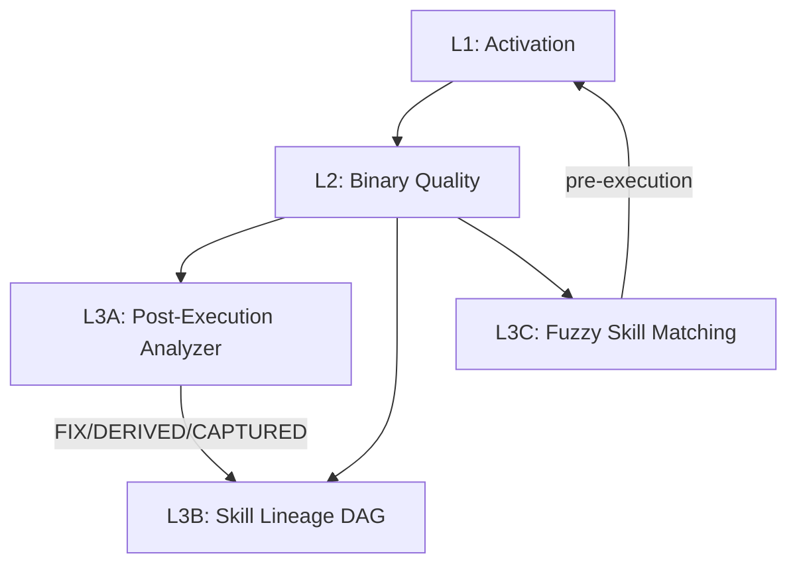
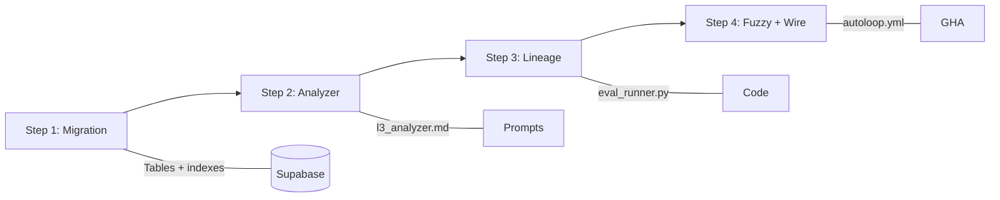

# AUTOLOOP L3: Self-Evolving Skills
## Extracted from OpenSpace (HKUDS/OpenSpace, REPOEVAL 58/100 EVAL)

**Status:** SPEC → Ready for SUMMIT dispatch
**Author:** Claude AI Architect
**Date:** 2026-03-29
**Source:** OpenSpace repo analysis (3 patterns extracted, framework NOT adopted)
**Honesty:** All claims VERIFIED from repo code analysis

---

## Overview

AUTOLOOP L1 (activation) and L2 (binary output quality) exist today with eval.json 25 binary assertions per skill. L3 adds three capabilities extracted from OpenSpace's skill_engine:



---

## Pattern 1: Post-Execution Analyzer

### What OpenSpace Does
After every task, an LLM grades execution and outputs structured JSON:
```yaml
ExecutionAnalysis:
  task_completed: bool
  execution_note: str
  skill_judgments:          # per-skill verdict
    - skill_id: str
      skill_applied: bool   # did agent actually use the skill?
      note: str
  evolution_suggestions:    # 0-N actions
    - type: fix|derived|captured
      target_skills: [skill_id]
      direction: str        # what to change
```

Three evolution types:
- **FIX**: Repair broken skill in-place (same name, new version)
- **DERIVED**: Create enhanced version from existing skill (new skill)
- **CAPTURED**: Brand new skill from novel pattern (no parent)

### Our Implementation
Replace binary pass/fail with LLM-graded analysis on AUTOLOOP nightly runs.

**Supabase table: `skill_analyses`**
```sql
CREATE TABLE skill_analyses (
  id UUID PRIMARY KEY DEFAULT gen_random_uuid(),
  skill_name TEXT NOT NULL,          -- e.g. 'zonewise', 'auction'
  task_id TEXT NOT NULL,             -- eval assertion ID
  run_id TEXT NOT NULL,              -- autoloop run ID
  task_completed BOOLEAN NOT NULL,
  execution_note TEXT,
  skill_applied BOOLEAN DEFAULT true,
  evolution_type TEXT CHECK (evolution_type IN ('fix', 'derived', 'captured', NULL)),
  evolution_direction TEXT,          -- what to change
  target_skill TEXT,                 -- parent skill for fix/derived
  analyzed_by TEXT DEFAULT 'gemini-flash', -- LLM used
  created_at TIMESTAMPTZ DEFAULT NOW()
);
CREATE INDEX idx_skill_analyses_skill ON skill_analyses(skill_name);
CREATE INDEX idx_skill_analyses_run ON skill_analyses(run_id);
```

**Integration point:** After eval_runner.py runs 25 assertions, pipe results + SKILL.md content to Gemini Flash for structured analysis. Cost: ~$0.02/skill/night (well within $10 budget).

**Analyzer prompt template** (stored in `cli-anything-biddeed/prompts/l3_analyzer.md`):
```
You are analyzing a CLI skill execution. Given:
- SKILL.md content
- 25 eval assertion results (pass/fail + output)
- Previous analysis history (if any)

Output ONLY JSON:
{
  "task_completed": true/false,
  "execution_note": "brief observation",
  "skill_applied": true/false,
  "evolution_suggestion": null | {
    "type": "fix|derived|captured",
    "target_skill": "skill_name or null",
    "direction": "what specifically to change"
  }
}
```

---

## Pattern 2: Skill Lineage DAG

### What OpenSpace Does
Every skill version is a node in a directed acyclic graph:
```yaml
SkillLineage:
  origin: imported|captured|derived|fixed
  generation: int              # distance from root
  parent_skill_ids: [str]      # empty for root nodes
  source_task_id: str           # what triggered evolution
  change_summary: str           # LLM-generated diff description
  content_diff: str             # unified diff
  content_snapshot: {file: content}  # full snapshot at this version
```

Quality metrics per skill:
```yaml
SkillRecord:
  total_selections: int    # times skill was chosen
  total_applied: int       # times actually used
  total_completions: int   # times task succeeded with skill
  total_fallbacks: int     # times skill failed
  # Derived:
  applied_rate: applied / selections
  completion_rate: completions / applied
  effective_rate: completions / selections
  fallback_rate: fallbacks / selections
```

### Our Implementation
Track skill evolution history in Supabase + git commits.

**Supabase table: `skill_lineage`**
```sql
CREATE TABLE skill_lineage (
  id UUID PRIMARY KEY DEFAULT gen_random_uuid(),
  skill_id TEXT NOT NULL,            -- e.g. 'zonewise__v3'
  skill_name TEXT NOT NULL,          -- e.g. 'zonewise'
  origin TEXT NOT NULL CHECK (origin IN ('imported', 'captured', 'derived', 'fixed')),
  generation INT DEFAULT 0,
  parent_skill_ids TEXT[] DEFAULT '{}',
  source_task_id TEXT,               -- autoloop run that triggered this
  change_summary TEXT,
  content_hash TEXT,                 -- SHA256 of SKILL.md at this version
  is_active BOOLEAN DEFAULT true,
  -- Quality counters (updated by autoloop)
  total_runs INT DEFAULT 0,
  total_pass INT DEFAULT 0,
  total_fail INT DEFAULT 0,
  pass_rate NUMERIC GENERATED ALWAYS AS (
    CASE WHEN total_runs > 0 THEN total_pass::numeric / total_runs ELSE 0 END
  ) STORED,
  created_at TIMESTAMPTZ DEFAULT NOW()
);
CREATE INDEX idx_lineage_skill ON skill_lineage(skill_name);
CREATE INDEX idx_lineage_active ON skill_lineage(is_active);
```

**Key difference from OpenSpace:** We use git commits as content_snapshot (already tracked) instead of storing full file content in DB. The `content_hash` links to the specific git commit.

**Cross-skill pattern transfer:** When zonewise skill gets a FIX that improves error handling, the analyzer checks if the same pattern applies to auction/discovery skills. This is the L3 differentiator — patterns propagate across domains.

---

## Pattern 3: Fuzzy Skill Matching (Pre-Execution)

### What OpenSpace Does
BM25 + embedding hybrid ranking:
1. **BM25 rough-rank**: Fast lexical search over all skills (name + description + body)
2. **Embedding re-rank**: Semantic similarity on top BM25 candidates
3. Threshold: If <10 skills, skip BM25 and send all to LLM selection

Also: 6-level fuzzy match chain for SEARCH/REPLACE edits:
```
Level 1: exact match
Level 2: line-trimmed (per-line strip)
Level 3: block-anchor (first/last line + Levenshtein middle)
Level 4: whitespace-normalized
Level 5: indentation-flexible
Level 6: trimmed-boundary
```

### Our Implementation
We have 4 skills (zonewise, auction, spatial, discovery). Too few for BM25/embedding overhead. Instead:

**Smart skill selection for autoloop:** Before running a task, check `skill_lineage` for the highest-performing skill version and load it. Currently autoloop always loads the current SKILL.md — this adds version awareness.

**Fuzzy assertion matching:** When eval assertions fail, use Levenshtein distance to determine if the output is "close enough" to warrant a FIX suggestion vs a full SKIP. Threshold: >0.7 similarity = FIX candidate, <0.3 = fundamentally broken.

**Implementation in eval_runner.py:**
```python
def levenshtein_similarity(a: str, b: str) -> float:
    """Normalized Levenshtein similarity (0-1)."""
    if not a and not b: return 1.0
    max_len = max(len(a), len(b))
    if max_len == 0: return 1.0
    dist = levenshtein(a, b)
    return 1.0 - (dist / max_len)

def classify_failure(expected: str, actual: str) -> str:
    sim = levenshtein_similarity(expected, actual)
    if sim > 0.7: return "fix"        # close, skill needs minor repair
    elif sim > 0.3: return "derived"  # partial match, needs enhancement
    else: return "captured"           # fundamentally different approach needed
```

---

## Execution Plan



### Step 1: Supabase Migration
- Create `skill_analyses` table
- Create `skill_lineage` table
- Seed lineage with current 4 skills as `imported` generation 0
- File: `cli-anything-biddeed/migrations/20260329_autoloop_l3.sql`

### Step 2: Post-Execution Analyzer
- Create `prompts/l3_analyzer.md` with structured JSON prompt
- Add `scripts/l3_analyze.py` that pipes eval results to Gemini Flash
- Output: structured JSON → `skill_analyses` table
- Cost guard: Gemini Flash free tier, fallback DeepSeek at $0.28/1M

### Step 3: Lineage Tracking
- Modify `scripts/eval_runner.py` to record lineage on skill changes
- Add `--l3` flag to autoloop.yml to enable analyzer post-eval
- Track content_hash via `git log --format=%H -1 -- skills/*/SKILL.md`
- Auto-deactivate old versions when new one passes at higher rate

### Step 4: Fuzzy Classification + Wire
- Add Levenshtein similarity to eval_runner.py for failure classification
- Wire analyzer suggestions into autoloop's keep/revert decision
- If analyzer says FIX → autoloop attempts targeted SKILL.md edit
- If analyzer says DERIVED → create new skill variant in skills/ dir
- If analyzer says CAPTURED → log for manual review (cross-domain)
- Update AUTOLOOP.md with L3 section

### Step 5: Cross-Skill Transfer (Future)
- When a FIX pattern succeeds for one skill, check applicability to others
- This is the true L3 differentiator — deferred until L3 base is stable
- Requires minimum 10 successful FIX operations as training data

---

## Cost Analysis

```yaml
per_night:
  eval_runner: existing (free, Gemini Flash)
  l3_analyzer: ~4 calls × $0.00 (Gemini Flash free tier)
  lineage_writes: ~4 rows × $0.00 (Supabase free tier)
  total: $0.00/night (within existing budget)
fallback:
  deepseek_analyzer: ~4 calls × $0.28/1M = ~$0.01/night
```

---

## Success Criteria (per Honesty Protocol)

All UNTESTED until deployed and measured:
- [ ] skill_analyses table populated after 3 consecutive nightly runs
- [ ] At least 1 FIX suggestion generated and applied successfully
- [ ] Lineage DAG shows generation > 0 for at least 1 skill
- [ ] Fuzzy classification correctly categorizes >80% of known failures
- [ ] Zero increase in autoloop runtime (< 5 min overhead for L3)

---

## Files to Create/Modify

```yaml
create:
  - cli-anything-biddeed/migrations/20260329_autoloop_l3.sql
  - cli-anything-biddeed/prompts/l3_analyzer.md
  - cli-anything-biddeed/scripts/l3_analyze.py
modify:
  - cli-anything-biddeed/scripts/eval_runner.py    # add --l3 flag + fuzzy
  - cli-anything-biddeed/.github/workflows/autoloop.yml  # wire L3 post-eval
  - cli-anything-biddeed/AUTOLOOP.md               # document L3
```
