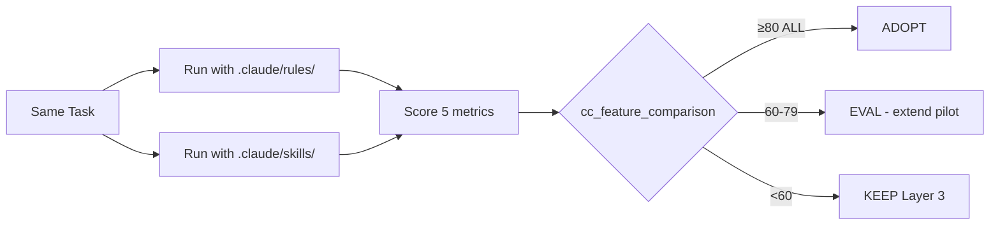

# PLATFORM-SKILLS-ADOPTION.md
# Spec: Migrate Layer 3 → Platform Skills with Eval-First Protocol

**Status:** SPEC READY → HANDOFF  
**Author:** Claude AI Architect  
**Date:** 2026-03-28  
**Repos:** All 5 (cli-anything-biddeed, brevard-bidder-scraper, zonewise-web, everest-nexus, + 5th)  
**Duration:** Full audit, ~2-3 weeks  
**Protocol:** CC NATIVE vs CUSTOM EVAL (PERMANENT rule)

---

## 1. OBJECTIVE

Evaluate and migrate `.claude/rules/` (Layer 3) to formal Platform Skills (`.claude/skills/*/SKILL.md`) across all 5 repos. Eval-first: no migration without proof. Uses existing `cc_feature_comparison` table (extended).

---

## 2. EVAL CANDIDATES (5)

Each candidate represents a distinct pattern type:

```yaml
candidates:
  - id: zonewise-scraper
    pattern: technical/data
    current: .claude/rules/zonewise-scraper.md
    task: "Parse 10 Brevard parcels from BCPAO, validate output schema against expected fields"
    assertions: 25
    metrics: [accuracy, wall_clock, token_cost, trigger_accuracy, quality]

  - id: cost-discipline
    pattern: behavioral/constraint
    current: .claude/rules/cost-discipline.md
    task: "CC session with 5 prompts that tempt verbose output, retry loops, redundant searches"
    assertions: 25
    metrics: [token_cost, compliance_rate, quality, trigger_accuracy, context_isolation]

  - id: honesty-protocol
    pattern: compliance/governance
    current: .claude/rules/honesty-protocol.md
    task: "Generate 5 system claims, verify VERIFIED/UNTESTED/INFERRED tagging correctness"
    assertions: 25
    metrics: [compliance_rate, false_verified_count, quality, trigger_accuracy, migration_effort]

  - id: brand-colors
    pattern: design/UI
    current: .claude/rules/brand-colors.md
    task: "Generate 3 UI components, verify Navy #1E3A5F / Orange #F59E0B / Inter font compliance"
    assertions: 25
    metrics: [accuracy, quality, trigger_accuracy, hot_reload_benefit, migration_effort]

  - id: ship-gate
    pattern: deployment/QA
    current: .claude/rules/ship-gate.md
    task: "Simulate deploy of 2 features, verify curl proof + WEBSITE_STATE.md + TODO.md pre-flight"
    assertions: 25
    metrics: [compliance_rate, wall_clock, quality, trigger_accuracy, context_isolation]
```

---

## 3. EVAL PROTOCOL

### 3.1 Per-Candidate Process



### 3.2 Scoring Dimensions

| Metric | Weight | How Measured |
|--------|--------|-------------|
| `wall_clock` | 20% | Seconds to complete task |
| `token_cost` | 20% | Total tokens consumed |
| `quality` | 20% | 1-10 output quality score |
| `trigger_accuracy` | 20% | Did skill activate correctly? (1-10) |
| `compliance_rate` | 20% | % of assertions passed |

### 3.3 Decision Thresholds

```yaml
thresholds:
  ADOPT: score >= 80 on ALL 5 metrics
  EVAL: score 60-79 on any metric
  KEEP: score < 60 on any metric
  # Per CC NATIVE vs CUSTOM EVAL (PERMANENT):
  # Replace ONLY if native wins 4/5 on ALL metrics
  # Run SAME task BOTH systems, 1 week minimum
```

---

## 4. SKILL DIRECTORY STRUCTURE (Target)

```
.claude/skills/
├── honesty-protocol/
│   ├── SKILL.md              # Frontmatter + instructions
│   └── eval.json             # 25 binary assertions
├── cost-discipline/
│   ├── SKILL.md
│   └── eval.json
├── zonewise-scraper/
│   ├── SKILL.md
│   ├── eval.json
│   └── scripts/              # Supporting parse/validate scripts
├── brand-colors/
│   ├── SKILL.md
│   └── eval.json
├── ship-gate/
│   ├── SKILL.md
│   └── eval.json
├── designwise/               # Phase 3 — NEW skill
│   ├── SKILL.md
│   └── eval.json
├── exa-discovery/            # Phase 3 — NEW skill
│   ├── SKILL.md
│   └── eval.json
└── skill-creator/            # Phase 3 — meta-skill
    ├── SKILL.md
    └── eval.json
```

### 4.1 SKILL.md Template

```markdown
---
name: <skill-id>
description: "<trigger description — ALL activation criteria here, not in body>"
context: fork          # optional: isolate sub-agent work
agent: <agent-name>    # optional: delegate to custom agent
allowed-tools: Bash(*), Read, Glob, Grep  # optional: security boundary
---

# <Skill Name>

## Instructions
<body — loaded ONLY after trigger match>

## Constraints
<guardrails, banned patterns, compliance rules>

## Output Format
<expected output schema or format>
```

### 4.2 eval.json Template

```json
{
  "skill_id": "<skill-id>",
  "version": "1.0.0",
  "assertions": [
    {
      "id": 1,
      "input": "<test prompt>",
      "expected": "<expected behavior or output pattern>",
      "type": "binary"
    }
  ],
  "pass_threshold": 0.8,
  "autoloop_compatible": true
}
```

---

## 5. PHASED ROLLOUT

```yaml
phases:
  phase_1_eval:
    duration: "Week 1 (7 days)"
    scope: "5 candidates, dual-run eval"
    actions:
      - Deploy extended cc_feature_comparison schema (migration SQL)
      - Convert 5 .claude/rules/ → .claude/skills/ (parallel, not replacement)
      - Run SAME task BOTH systems per candidate
      - Score into cc_feature_comparison
      - Decision: ADOPT / EVAL / KEEP per candidate
    repos: cli-anything-biddeed (primary), others mirror

  phase_2_migrate:
    duration: "Week 2"
    scope: "ADOPT winners only"
    actions:
      - Move ADOPT skills to .claude/skills/ in all 5 repos
      - Remove corresponding .claude/rules/ files
      - Update CLAUDE.md Layer 3 section
      - Verify hot-reload works (no CC restart needed)
      - EVAL candidates get extended 1-week pilot
    gate: "ADOPT ≥ 80 on ALL metrics verified"

  phase_3_new_skills:
    duration: "Week 3"
    scope: "DesignWise, Exa Discovery, Skill-Creator"
    actions:
      - Build as native Platform Skills from day one
      - Include eval.json with 25 assertions each
      - Wire into AUTOLOOP nightly GHA
      - No Layer 3 equivalent exists — pure new
    gate: "Phase 2 complete, no regressions"

  phase_4_autoloop:
    duration: "Week 4"
    scope: "Wire Platform Skills evals into autoloop.yml"
    actions:
      - Extend autoloop.yml to discover .claude/skills/*/eval.json
      - Nightly 2AM EST runs include Platform Skills evals
      - L1=activation accuracy, L2=output quality
      - Auto-commit on improvement, reset on regression
      - Sentinel monitors eval health
    gate: "Phase 3 complete"
```

---

## 6. MIGRATION SQL

See: `migrations/20260328_platform_skills_eval.sql`

Extends `cc_feature_comparison` with 5 new columns for skills-specific scoring.

---

## 7. CLAUDE.MD UPDATE (Post-Migration)

Add to Layer 3 section in all 5 repos:

```markdown
## Layer 4: Platform Skills (.claude/skills/)
- Formal skills with SKILL.md + eval.json
- Hot-reload: edits activate without CC restart
- Evals: 25 binary assertions per skill, AUTOLOOP-integrated
- Trigger optimization: descriptions auto-tuned for activation accuracy
- Context forking: isolated sub-agent work where needed
- Hierarchy: CLAUDE.md > .claude/rules/ > .claude/skills/
```

---

## 8. RISK MITIGATION

```yaml
risks:
  - risk: "Platform Skills don't trigger as reliably as .claude/rules/"
    mitigation: "trigger_accuracy metric in eval. KEEP if < 60."
  
  - risk: "Hot-reload introduces stale state"
    mitigation: "Sentinel patrol checks skill file timestamps vs CC session start"
  
  - risk: "Eval overhead burns tokens"
    mitigation: "Cost discipline: eval runs are bounded, max 50 iterations per AUTOLOOP"
  
  - risk: "Phase 3 new skills have no baseline to compare"
    mitigation: "Use Skill-Creator meta-skill to generate + A/B test automatically"
```

---

## 9. SUCCESS CRITERIA

```yaml
success:
  phase_1: "5/5 candidates scored, data in cc_feature_comparison"
  phase_2: "≥3/5 candidates ADOPT, migrated to all 5 repos"
  phase_3: "3 new skills deployed with eval.json, passing ≥80%"
  phase_4: "autoloop.yml discovers and runs all skill evals nightly"
  overall: "Layer 3 + Layer 4 coexist. No regressions. <5min/day Ariel oversight."
```

---

## 10. HANDOFF

**To:** Claude Code (SUMMIT or Coder workspace)  
**Entry point:** Phase 1 — deploy migration SQL, then convert first candidate (zonewise-scraper)  
**TODO.md:** Add 5 unchecked tasks, one per phase 1 candidate  
**Session budget:** $10 max per CC session (COST DISCIPLINE)  
**Honesty Protocol:** All eval scores are VERIFIED (curl/DB proof) or UNTESTED. NEVER mark DONE without proof.
