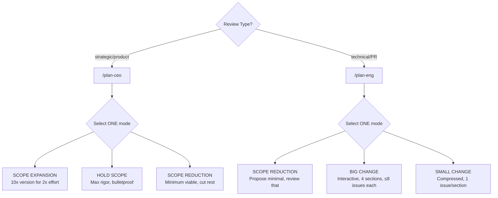
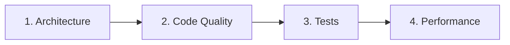
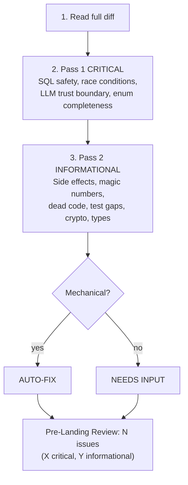
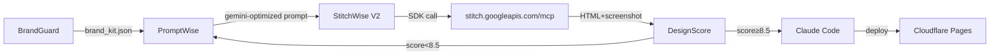
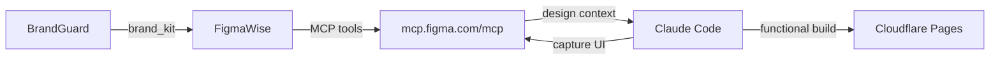

# CLAUDE.md — BidDeed.AI / Everest Capital USA

## Identity
```yaml
founder: Ariel Shapira
company: BidDeed.AI / Everest Capital USA
experience: 10+ yr foreclosure investing, Brevard County FL
licenses: FL broker, general contractor
style: direct, no softening, facts+actions
adhd: systems must self-run
```

## Stack
```yaml
repos: github.com/breverdbidder/*
  active: [cli-anything-biddeed, zonewise-scraper-v4, biddeed-ai, biddeed-ai-ui, zonewise-web, cliproxy-gateway, tax-insurance-optimizer]
db: Supabase mocerqjnksmhcjzxrewo.supabase.co
  tables: [multi_county_auctions(245K), activities, insights, daily_metrics]
compute: Hetzner 87.99.129.125 (CLIProxyAPI 127.0.0.1:8317)
ai:
  free: Gemini Flash (CLIProxyAPI) — DEAD, keys expired
  cheap: DeepSeek V3.2 ($0.28/1M)
  primary: Claude (Max plan, never API)
deploy: [GitHub Actions, Cloudflare Pages, Render]
brand: { primary: "#1E3A5F", accent: "#F59E0B", font: Inter, bg: "#020617" }
```

## 3-Layer CLAUDE.md Hierarchy (Claude Architect Standard)
```yaml
layer_1_user: ~/.claude/CLAUDE.md  # personal prefs, not version-controlled
layer_2_project: ./CLAUDE.md       # THIS FILE — team rules, architecture, triggers
layer_3_path_rules: .claude/rules/ # pattern-matched, loaded ONLY when editing matching files
  deployed: [harness(*/SKILL.md), evals(*/eval/**), scripts(scripts/**), youtube(youtube/**), instruction-patterns(docs/INSTRUCTION-ENGINEERING-PATTERNS.md)]
  principle: lean context window — rules load only when relevant
  enforcement: hooks for 100% reliability (finance/security), prompts for style/tone
```


## Context Rules
```yaml
triggers:
  auction_or_property: query Supabase multi_county_auctions first
  case_number: search multi_county_auctions.case_number
  deal_analysis: apply (ARV×70%)-Repairs-$10K-MIN($25K,15%×ARV)
  pipeline_health: check daily_metrics + recent GHA runs
  county_mention: verify counties/ config exists before assuming
  build_request: follow cli-anything HARNESS.md 7-phase
  skill_or_harness_authoring: load docs/INSTRUCTION-ENGINEERING-PATTERNS.md first
  deploy: push to GitHub, never local/GDrive
  spend_over_10: STOP and confirm
  context_switch: flag "📌 [previous task] still open"
  summit: execute immediately, zero questions
```

## Work Principles
```yaml
rules:
  - execute first, report results
  - $10/session max, batch ops, one attempt per approach
  - zero HITL: 3 alternatives before surfacing blocker
  - push back with strong opinions when disagreeing
  - wrong = "I was wrong", never invent numbers
```

## Instruction Engineering (Mar 25, 2026)
```yaml
source: docs/INSTRUCTION-ENGINEERING-PATTERNS.md
origin: VoltAgent/awesome-codex-subagents (136 agents analyzed)
when_to_load: authoring or editing ANY SKILL.md, HARNESS.md, or agent prompt
patterns:
  4_phase_working_mode: Map → Separate evidence from hypothesis → Smallest intervention → Validate
  ownership_declaration: "Own [domain] as [framing], not [anti-pattern]"
  focus_areas: 6-8 items naming concrete boundaries/tradeoffs (not abstract concepts)
  quality_gates: verify/confirm/check/ensure/call_out (binary, not aspirational)
  return_contract: scope → finding+evidence → intervention → validated → residual
  guard_rail: single "Do not [#1 failure mode]" per agent
  confidence_labels: CONFIRMED | HYPOTHESIS | UNKNOWN (enforces NEVER-LIE)
  sandbox_mode: read-only for reviewers, workspace-write for builders
```

## Slash Commands
```yaml
commands:
  /auction-brief: morning auction briefing from Supabase
  /county-setup: onboard new FL county
  /deal-intel: process foreclosure docs → structured data
  /tldr: end-of-session summary, update memory.md
  /transcript: YouTube video analysis via Hetzner pipeline
  /animated-ui: >
    5-phase: Design System → 21st.dev → Animation → Assets → Build.
    Enforces house brand. Auto-deployed from claude-skills-library to Hetzner.
```

## Family
```yaml
wife: Mariam (Property360 real estate, Protection Partners insurance, contracting)
son: Michael (16, D1 swimmer, Satellite Beach HS, keto diet, Shabbat)
observance: Orthodox (Shabbat Fri sunset–Sat havdalah, kosher, holidays)
```

## Session Hygiene (Mar 15, 2026)

### Mandatory Plugins
```yaml
plugins:
  context7: { purpose: live API docs, install: "/plugin → context7", cost: $0 }
  cc-status-line: { purpose: context monitor, install: "npx cc-status-line@latest" }
  cctop: { purpose: sessions dashboard, install: "curl -fsSL https://raw.githubusercontent.com/DeanLa/cctop/main/install.sh | bash", fork: breverdbidder/cctop }
```

### Context Window Rules
```yaml
rules:
  context_brackets:
    FRESH_gt70pct: "Full file reads OK. Complex multi-step work OK. Parallel ops OK."
    MODERATE_40_70pct: "Re-read STATE before decisions. Summaries over full files. Single-concern tasks."
    DEEP_20_40pct: "Finish current task ONLY. Prepare session summary. No new complex work."
    CRITICAL_lt20pct: "Write session summary NOW. Update TODO.md. No new file reads. Exit."
  never_compact: loses working context, keeps stale — always fresh start
  sub_agents: dispatch via Superpowers for heavy work
  harness_checkpoint: save state + restart if >50% mid-pipeline
cc_status_line:
  line1: "model | context% | session_cost | session_clock"
  line2: "git_branch | git_worktree"
```

---

## Loop Discipline (Mar 25, 2026)

### Evidence-Before-Claims (upgrades NEVER-LIE)
```yaml
# The evidence chain: Execute → Verify → Read output → Compare to spec → THEN claim.
# Breaking ANY link = false completion.
anti_rationalization:
  "Should work now":           "Run the verify command and read its output"
  "I already checked this":    "Check it again fresh — memory of checking ≠ verification"
  "It's close enough":         "Compare against the AC/spec word by word"
  "The test passes":           "Also compare against the spec — tests can be incomplete"
  "This is a minor deviation": "Log it explicitly — minor deviations compound into drift"
  "I'm confident it works":    "Run it and prove it — confidence without evidence is failure cause #1"
rules:
  - NEVER mark a task [x] in TODO.md without fresh verification evidence in same session
  - NEVER claim a DB count, %, or metric without running the actual query first
  - When wrong: say "I was wrong" — not "I misspoke" or "let me clarify"
```

### Scope Classification (pre-step to all tasks)
```yaml
# Before executing ANY task, classify scope FIRST:
scope_classification:
  quick_fix:
    signals: "Fits 1 sentence AND 1-2 files AND no architectural implications"
    ceremony: "No spec. Execute directly. Mark [x] with 1-line commit."
  standard:
    signals: "3-5 files OR design decision needed OR multiple components"
    ceremony: "Spec recommended. Full protocol. Session summary required."
  complex:
    signals: "6+ files OR architectural change OR multi-repo OR new patterns/deps"
    ceremony: "Spec MANDATORY (BRAINSTORM_PROTOCOL). Must split into sub-tasks."
# Classify BEFORE work starts. When uncertain → choose HIGHER ceremony.
```

### Boundaries Enforcement
```yaml
# Every spec/plan SHOULD include a boundaries section.
# When present, boundaries are HARD constraints, not suggestions.
boundaries:
  DO_NOT_CHANGE: "STOP and confirm before ANY modification to listed items"
  SCOPE_LIMITS: "Log to deferred issues if encountered, do not address"
# No boundaries in spec? → ask once at session start: "Any files I should avoid touching?"
# SUMMIT-dispatched work → treat spec as full scope, nothing beyond it.
```

### Session Summary Loop Closure
```yaml
# Every session summary MUST include (in addition to Status Board):
loop_closure:
  plan_vs_actual: "| Task | Planned | Actual | Deviation | — ALWAYS required"
  deviation_log: "What changed, why, downstream impact — required if any deviation"
  verification_evidence: "Command run → output observed → spec comparison — required if any task completed"
# The session summary IS the loop closure. No summary = orphaned loop.
# Evidence-Before-Claims applies: don't claim DONE without proof in the summary.
```


# GSTACK PATTERNS
```yaml
source: garrytan/gstack (MIT)
deployed: Mar 17, 2026
fork: breverdbidder/gstack
```

## AskUserQuestion Format (MANDATORY)
```yaml
format:
  1_reground: project + branch + current task (1-2 sentences)
  2_eli16: plain English a 16yo follows, no jargon, concrete examples
  3_recommend: "RECOMMENDATION: Choose [X] because [reason]"
  4_options: "A) ... B) ... C) ..."
assumption: user hasn't looked in 20 min, no code open
```

## Review Modes



### CEO Mode Directives
```yaml
directives:
  - zero silent failures — every failure mode visible
  - every error has a name — specific exception, not "handle errors"
  - data flows have shadow paths — nil, empty, upstream error
  - diagrams mandatory — Mermaid for every new data flow
  - deferred = written in TODOS.md or doesn't exist
  - optimize for 6-month future
  - permission to say "scrap it and do this instead"
critical: once mode selected, NEVER drift to another
```

### Eng Mode Sections

```yaml
eng_sections:
  architecture: [system design, dependencies, coupling, scaling, security, failure scenarios]
  code_quality: [DRY, error handling, edge cases, tech debt, over/under-engineering]
  tests: [diagram UX/data/code flows, verify test exists, check eval.json]
  performance: [N+1 queries, unbounded selects, missing indexes, recomputation]
rule: STOP after each section, present issues one-at-a-time, resolve before next
```

## Fix-First Review (MANDATORY)


## visual-explainer Skill
```yaml
source: ~/.claude/skills/visual-explainer/plugins/visual-explainer/SKILL.md
output: ~/.agent/diagrams/ (open in browser)
commands: [/diff-review, /plan-review, /project-recap, /generate-web-diagram, /generate-slides, /fact-check]
brand: templates/biddeed-brand-preset.html
auto_trigger: "table 4+ rows OR 3+ columns → HTML, never ASCII"
```

## gh-aw Integration (Mar 23, 2026)

### Active Agentic Workflows
- `doc-sync-agent.md` — Auto-updates docs on code push (auto-merge)
- `issue-triage-agent.md` — Labels new issues P0-P3 + type
- `ci-failure-agent.md` — Diagnoses CI failures, opens fix issues
- `pr-gate-agent.md` — Classifies PR risk: LOW/MEDIUM/HIGH
- `dep-guardian-agent.md` — Weekly dependency updates (Monday 3AM EST)
- `changelog-agent.md` — Auto-changelog on release

### Merge Strategy
- LOW risk: auto-merge (docs, deps patch, style, tests)
- MEDIUM risk: merge after CI green
- HIGH risk: needs-human-review label → Ariel reviews

### Engine
All workflows use `engine: claude` with ANTHROPIC_API_KEY secret.


## AUTODREAM (Memory 2.0)

Status: PENDING_ACTIVATION

```yaml
autodream:
  what: Background sub-agent that consolidates/prunes memory .md files
  layers:
    L1: Normal sessions (code, debug, refactor)
    L2: AutoMemory (records decisions/patterns to memory.md)
    L3: AutoDream (compacts/prunes L2 files periodically)
  activation: /memory toggle AutoDream ON then /dream to invoke
  cadence: ~12hr or ~300 sessions (unconfirmed)
  scope: Only .md memory files, NEVER code/scripts
  duration: 8-10 min typical
  rules:
    - Enable per-repo once available
    - Do NOT disable AutoMemory (L2 feeds L3)
    - Verify pruned files after first dream
    - If AutoDream conflicts with CLAUDE.md manual sections, CLAUDE.md wins
```
# ── StitchWise V2 Pipeline (added 2026-03-25) ──

## Stitch Integration


## Stitch Config
```yaml
sdk: "@google/stitch-sdk"
mcp: "@_davideast/stitch-mcp proxy"
auth: GEMINI_API_KEY (env)
budget: 300 gen/mo (350 limit - 50 reserve)
circuit_breaker: 3 retries/design
brand: navy=#1E3A5F, orange=#F59E0B, bg=#020617, font=Inter
commands: generate | list | export | dashboard | landing
```

# ── FigmaWise Pipeline (added 2026-03-25) ──

## Figma MCP Integration


## Figma Config
```yaml
mcp: https://mcp.figma.com/mcp (remote, OAuth)
plugin: figma@claude-plugins-official
auth: OAuth (one-time, token persists in ~/.claude/)
tools: extract|implement|capture|variables|audit|write
brand: navy=#1E3A5F, orange=#F59E0B, bg=#020617, font=Inter
rate_limit: Per-minute (paid seat) or 6/mo (free)
```

## MCP Servers (registered 2026-03-27)
```yaml
exa:
  command: npx -y mcp-remote https://mcp.exa.ai/mcp
  transport: http
  env: EXA_API_KEY (GitHub Actions secret — deployed to 4 repos)
  status: LIVE ✅
  use: Layer 2 semantic search for discovery harness
figma:
  url: https://mcp.figma.com/mcp
  transport: http
  status: REGISTERED — OAuth PENDING
stitch:
  command: npx -y @_davideast/stitch-mcp proxy
  transport: stdio
  status: REGISTERED — GEMINI_API_KEY required
```

## Exa Discovery Harness (deployed 2026-03-27)
```yaml
path: discovery/
modes: [zonewise, auction, gtm]
pipeline: query_build → exa_search → filter_rank → persist → firecrawl_handoff
table: discovery_results (MIGRATION PENDING — run migrations/20260327_discovery_results.sql)
eval: discovery/eval/discovery/eval.json (25 assertions)
cost_cap: $10/session
67_county_cost: ~$8.38
cli:
  zonewise: node discovery/src/index.js zonewise --county "Orange"
  auction: node discovery/src/index.js auction --county "Brevard"
  gtm: node discovery/src/index.js gtm --vertical "FL title companies"
  batch: node discovery/src/index.js zonewise --batch
  dry_run: node discovery/src/index.js zonewise --county "Duval" --dry-run
```
