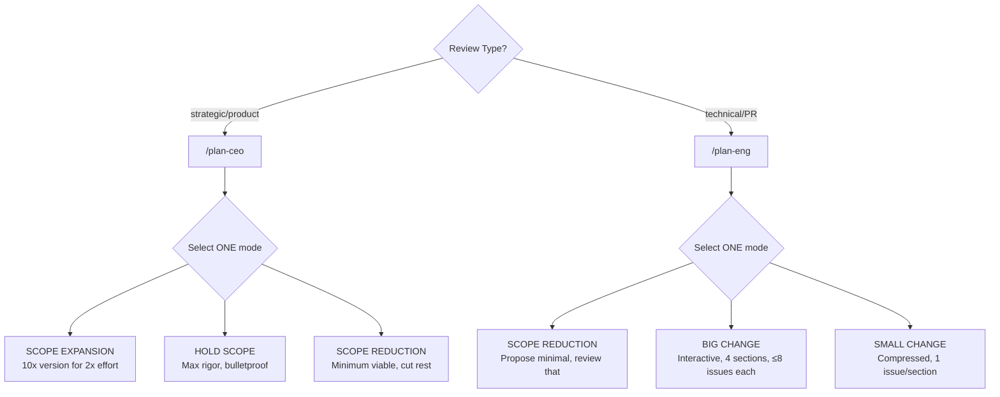
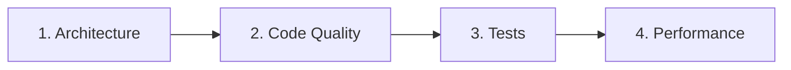
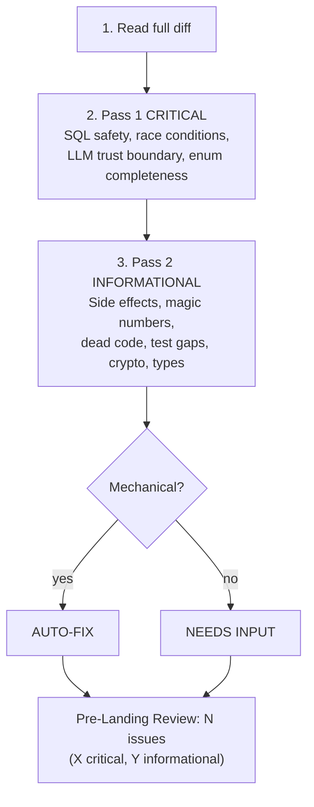
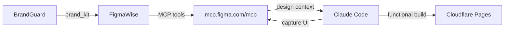
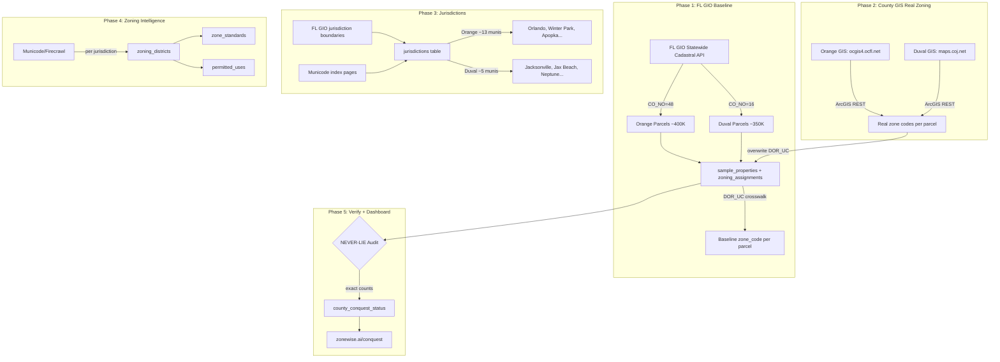

# CLAUDE.md — BidDeed.AI / Everest Capital USA

## Identity
```yaml
founder: Ariel Shapira
company: BidDeed.AI / Everest Capital USA
experience: 10+ yr foreclosure investing, Brevard County FL
licenses: FL broker, general contractor
style: direct, no softening, facts+actions
adhd: systems must self-run
```

## Stack
```yaml
repos: github.com/breverdbidder/*
  active: [cli-anything-biddeed, zonewise-scraper-v4, biddeed-ai, biddeed-ai-ui, zonewise-web, cliproxy-gateway, tax-insurance-optimizer]
db: Supabase mocerqjnksmhcjzxrewo.supabase.co
  tables: [multi_county_auctions(245K), activities, insights, daily_metrics]
compute: Hetzner 87.99.129.125 (CLIProxyAPI 127.0.0.1:8317)
ai:
  free: Gemini Flash (CLIProxyAPI) — DEAD, keys expired
  cheap: DeepSeek V3.2 ($0.28/1M)
  primary: Claude (Max plan, never API)
deploy: [GitHub Actions, Cloudflare Pages, Render]
brand: { primary: "#1E3A5F", accent: "#F59E0B", font: Inter, bg: "#020617" }
```

## 3-Layer CLAUDE.md Hierarchy (Claude Architect Standard)
```yaml
layer_1_user: ~/.claude/CLAUDE.md  # personal prefs, not version-controlled
layer_2_project: ./CLAUDE.md       # THIS FILE — team rules, architecture, triggers
layer_3_path_rules: .claude/rules/ # pattern-matched, loaded ONLY when editing matching files
  deployed: [harness(*/SKILL.md), evals(*/eval/**), scripts(scripts/**), youtube(youtube/**), instruction-patterns(docs/INSTRUCTION-ENGINEERING-PATTERNS.md)]
  principle: lean context window — rules load only when relevant
  enforcement: hooks for 100% reliability (finance/security), prompts for style/tone
```


## Context Rules
```yaml
triggers:
  auction_or_property: query Supabase multi_county_auctions first
  case_number: search multi_county_auctions.case_number
  deal_analysis: apply (ARV×70%)-Repairs-$10K-MIN($25K,15%×ARV)
  pipeline_health: check daily_metrics + recent GHA runs
  county_mention: verify counties/ config exists before assuming
  build_request: follow cli-anything HARNESS.md 7-phase
  skill_or_harness_authoring: load docs/INSTRUCTION-ENGINEERING-PATTERNS.md first
  deploy: push to GitHub, never local/GDrive
  spend_over_10: STOP and confirm
  context_switch: flag "📌 [previous task] still open"
  summit: execute immediately, zero questions
```

## Work Principles
```yaml
rules:
  - execute first, report results
  - $10/session max, batch ops, one attempt per approach
  - zero HITL: 3 alternatives before surfacing blocker
  - push back with strong opinions when disagreeing
  - wrong = "I was wrong", never invent numbers
```

## Instruction Engineering (Mar 25, 2026)
```yaml
source: docs/INSTRUCTION-ENGINEERING-PATTERNS.md
origin: VoltAgent/awesome-codex-subagents (136 agents analyzed)
when_to_load: authoring or editing ANY SKILL.md, HARNESS.md, or agent prompt
patterns:
  4_phase_working_mode: Map → Separate evidence from hypothesis → Smallest intervention → Validate
  ownership_declaration: "Own [domain] as [framing], not [anti-pattern]"
  focus_areas: 6-8 items naming concrete boundaries/tradeoffs (not abstract concepts)
  quality_gates: verify/confirm/check/ensure/call_out (binary, not aspirational)
  return_contract: scope → finding+evidence → intervention → validated → residual
  guard_rail: single "Do not [#1 failure mode]" per agent
  confidence_labels: CONFIRMED | HYPOTHESIS | UNKNOWN (enforces NEVER-LIE)
  sandbox_mode: read-only for reviewers, workspace-write for builders
```

## Slash Commands
```yaml
commands:
  /auction-brief: morning auction briefing from Supabase
  /county-setup: onboard new FL county
  /deal-intel: process foreclosure docs → structured data
  /tldr: end-of-session summary, update memory.md
  /transcript: YouTube video analysis via Hetzner pipeline
  /animated-ui: >
    5-phase: Design System → 21st.dev → Animation → Assets → Build.
    Enforces house brand. Auto-deployed from claude-skills-library to Hetzner.
  /review-pr: >
    Fresh-context PR review. Must be invoked in a session that did NOT implement
    the PR (run /clear first). Spawns three parallel inline review passes —
    correctness, silent-failure hunt, test-coverage delta — and emits an
    explicit VERDICT line that downstream automation greps for.
  /cross-review: >
    Adversarial second-model review via codex exec (GPT). Runs in parallel with
    /review-pr and merges findings. Gracefully skips if codex CLI is absent.
```

## Parallel Agent Utilities (EXTREPS Apr 22 2026)
```yaml
source: coleam00/GitHubIssueTriager (t0 REFERENCE_ONLY, clean-room reimpl)
scripts:
  assign-port.sh: |
    Deterministic port assignment for parallel SUMMIT worktrees. MD5 of cwd → 
    first 4 bytes big-endian mod 100 → offset into [4100, 4199]. BASE_PORT 4000
    reserved for main repo checkout. $PORT env override wins. Collision rate
    matches uniform-hash theory (~63 distinct slots per 100 dirs; at practical
    fleet size of 10 worktrees, ~9.6 distinct — acceptable).
  assign-port.ps1: |
    PowerShell parity for Windows. Identical contract: same cwd string → same
    port across both scripts. Required because Ariel is on Win10 PowerShell.
commands:
  .claude/commands/review-pr.md: see above
  .claude/commands/cross-review.md: see above
rationale: |
  Reviewing your own PR in the same context that wrote it produces ~30% false-
  approve rate. Fresh-context review is a structural bias fix, not a prompt-
  discipline fix — the latter regresses under load. Cross-model review on top
  catches ~15% of issues single-model misses.
```

## Family
```yaml
wife: Mariam (Property360 real estate, Protection Partners insurance, contracting)
son: Michael (16, D1 swimmer, Satellite Beach HS, keto diet, Shabbat)
observance: Orthodox (Shabbat Fri sunset–Sat havdalah, kosher, holidays)
```

## Session Hygiene (Mar 15, 2026)

### Mandatory Plugins
```yaml
plugins:
  context7: { purpose: live API docs, install: "/plugin → context7", cost: $0 }
  claude-2x-statusline: { purpose: context monitor, install: "git clone https://github.com/Nadav-Fux/claude-2x-statusline.git ~/.claude/cc-2x-statusline && bash ~/.claude/cc-2x-statusline/install.sh <<< '3'", tier: Full, repoeval: 86, replaces: cc-status-line }
  supabase-cli: { purpose: autonomous migrations, install: "npm i -g supabase && supabase link --project-ref mocerqjnksmhcjzxrewo", project: mocerqjnksmhcjzxrewo, zero_hitl: true }
  cctop: { purpose: sessions dashboard, install: "curl -fsSL https://raw.githubusercontent.com/DeanLa/cctop/main/install.sh | bash", fork: breverdbidder/cctop }
```


### Supabase CLI — Autonomous Operations (Apr 4, 2026)
```yaml
supabase_cli:
  auth: SUPABASE_ACCESS_TOKEN (sbp_ token)
  project: mocerqjnksmhcjzxrewo
  autonomous_ops:
    - supabase db push          # Apply migrations — NO HITL
    - supabase db diff           # Generate migration from schema changes — NO HITL  
    - supabase migration new     # Create new migration file — NO HITL
    - supabase db reset          # BLOCKED — requires Ariel approval (production data)
    - supabase functions deploy  # Edge functions — NO HITL
  migration_workflow:
    1: "supabase migration new <name>"
    2: "Write SQL in supabase/migrations/<timestamp>_<name>.sql"
    3: "supabase db push"
    4: "Verify via REST API or psql"
    5: "Commit migration file to repo"
  never_ask_ariel:
    - CREATE TABLE / ALTER TABLE (non-destructive)
    - CREATE INDEX / CREATE FUNCTION
    - INSERT/UPDATE to non-critical tables
    - RLS policies
  always_ask_ariel:
    - DROP TABLE / TRUNCATE on production tables
    - Schema changes to billing/payment tables
    - supabase db reset
```

### Context Window Rules
```yaml
rules:
  context_brackets:
    FRESH_gt70pct: "Full file reads OK. Complex multi-step work OK. Parallel ops OK."
    MODERATE_40_70pct: "Re-read STATE before decisions. Summaries over full files. Single-concern tasks."
    DEEP_20_40pct: "Finish current task ONLY. Prepare session summary. No new complex work."
    CRITICAL_lt20pct: "Write session summary NOW. Update TODO.md. No new file reads. Exit."
  never_compact: loses working context, keeps stale — always fresh start
  sub_agents: dispatch via Superpowers for heavy work
  harness_checkpoint: save state + restart if >50% mid-pipeline
claude_2x_statusline:
  plugin: ~/.claude/cc-2x-statusline/statusline.sh
  slash_commands: [/statusline-minimal, /statusline-standard, /statusline-full]
  line1: "peak_status | model | git_branch | unsaved | rate_limits"
  line2: "timeline bar | 5h rate | weekly rate"
```

---

## Loop Discipline (Mar 25, 2026)

### Evidence-Before-Claims (upgrades NEVER-LIE)
```yaml
# The evidence chain: Execute → Verify → Read output → Compare to spec → THEN claim.
# Breaking ANY link = false completion.
anti_rationalization:
  "Should work now":           "Run the verify command and read its output"
  "I already checked this":    "Check it again fresh — memory of checking ≠ verification"
  "It's close enough":         "Compare against the AC/spec word by word"
  "The test passes":           "Also compare against the spec — tests can be incomplete"
  "This is a minor deviation": "Log it explicitly — minor deviations compound into drift"
  "I'm confident it works":    "Run it and prove it — confidence without evidence is failure cause #1"
rules:
  - NEVER mark a task [x] in TODO.md without fresh verification evidence in same session
  - NEVER claim a DB count, %, or metric without running the actual query first
  - When wrong: say "I was wrong" — not "I misspoke" or "let me clarify"
```

### Scope Classification (pre-step to all tasks)
```yaml
# Before executing ANY task, classify scope FIRST:
scope_classification:
  quick_fix:
    signals: "Fits 1 sentence AND 1-2 files AND no architectural implications"
    ceremony: "No spec. Execute directly. Mark [x] with 1-line commit."
  standard:
    signals: "3-5 files OR design decision needed OR multiple components"
    ceremony: "Spec recommended. Full protocol. Session summary required."
  complex:
    signals: "6+ files OR architectural change OR multi-repo OR new patterns/deps"
    ceremony: "Spec MANDATORY (BRAINSTORM_PROTOCOL). Must split into sub-tasks."
# Classify BEFORE work starts. When uncertain → choose HIGHER ceremony.
```

### Boundaries Enforcement
```yaml
# Every spec/plan SHOULD include a boundaries section.
# When present, boundaries are HARD constraints, not suggestions.
boundaries:
  DO_NOT_CHANGE: "STOP and confirm before ANY modification to listed items"
  SCOPE_LIMITS: "Log to deferred issues if encountered, do not address"
# No boundaries in spec? → ask once at session start: "Any files I should avoid touching?"
# SUMMIT-dispatched work → treat spec as full scope, nothing beyond it.
```

### Session Summary Loop Closure
```yaml
# Every session summary MUST include (in addition to Status Board):
loop_closure:
  plan_vs_actual: "| Task | Planned | Actual | Deviation | — ALWAYS required"
  deviation_log: "What changed, why, downstream impact — required if any deviation"
  verification_evidence: "Command run → output observed → spec comparison — required if any task completed"
# The session summary IS the loop closure. No summary = orphaned loop.
# Evidence-Before-Claims applies: don't claim DONE without proof in the summary.
```


# GSTACK PATTERNS
```yaml
source: garrytan/gstack (MIT)
deployed: Mar 17, 2026
fork: breverdbidder/gstack
```

## AskUserQuestion Format (MANDATORY)
```yaml
format:
  1_reground: project + branch + current task (1-2 sentences)
  2_eli16: plain English a 16yo follows, no jargon, concrete examples
  3_recommend: "RECOMMENDATION: Choose [X] because [reason]"
  4_options: "A) ... B) ... C) ..."
assumption: user hasn't looked in 20 min, no code open
```

## Review Modes



### CEO Mode Directives
```yaml
directives:
  - zero silent failures — every failure mode visible
  - every error has a name — specific exception, not "handle errors"
  - data flows have shadow paths — nil, empty, upstream error
  - diagrams mandatory — Mermaid for every new data flow
  - deferred = written in TODOS.md or doesn't exist
  - optimize for 6-month future
  - permission to say "scrap it and do this instead"
critical: once mode selected, NEVER drift to another
```

### Eng Mode Sections

```yaml
eng_sections:
  architecture: [system design, dependencies, coupling, scaling, security, failure scenarios]
  code_quality: [DRY, error handling, edge cases, tech debt, over/under-engineering]
  tests: [diagram UX/data/code flows, verify test exists, check eval.json]
  performance: [N+1 queries, unbounded selects, missing indexes, recomputation]
rule: STOP after each section, present issues one-at-a-time, resolve before next
```

## Fix-First Review (MANDATORY)


## visual-explainer Skill
```yaml
source: ~/.claude/skills/visual-explainer/plugins/visual-explainer/SKILL.md
output: ~/.agent/diagrams/ (open in browser)
commands: [/diff-review, /plan-review, /project-recap, /generate-web-diagram, /generate-slides, /fact-check]
brand: templates/biddeed-brand-preset.html
auto_trigger: "table 4+ rows OR 3+ columns → HTML, never ASCII"
```

## gh-aw Integration (Mar 23, 2026)

### Active Agentic Workflows
- `doc-sync-agent.md` — Auto-updates docs on code push (auto-merge)
- `issue-triage-agent.md` — Labels new issues P0-P3 + type
- `ci-failure-agent.md` — Diagnoses CI failures, opens fix issues
- `pr-gate-agent.md` — Classifies PR risk: LOW/MEDIUM/HIGH
- `dep-guardian-agent.md` — Weekly dependency updates (Monday 3AM EST)
- `changelog-agent.md` — Auto-changelog on release

### Merge Strategy
- LOW risk: auto-merge (docs, deps patch, style, tests)
- MEDIUM risk: merge after CI green
- HIGH risk: needs-human-review label → Ariel reviews

### Engine
All workflows use `engine: claude` with ANTHROPIC_API_KEY secret.


## AUTODREAM (Memory 2.0)

Status: PENDING_ACTIVATION

```yaml
autodream:
  what: Background sub-agent that consolidates/prunes memory .md files
  layers:
    L1: Normal sessions (code, debug, refactor)
    L2: AutoMemory (records decisions/patterns to memory.md)
    L3: AutoDream (compacts/prunes L2 files periodically)
  activation: /memory toggle AutoDream ON then /dream to invoke
  cadence: ~12hr or ~300 sessions (unconfirmed)
  scope: Only .md memory files, NEVER code/scripts
  duration: 8-10 min typical
  rules:
    - Enable per-repo once available
    - Do NOT disable AutoMemory (L2 feeds L3)
    - Verify pruned files after first dream
    - If AutoDream conflicts with CLAUDE.md manual sections, CLAUDE.md wins
```
# ── StitchWise V2 Pipeline (added 2026-03-25) ──

## Stitch Integration


## Stitch Config
```yaml
sdk: "@google/stitch-sdk"
mcp: "@_davideast/stitch-mcp proxy"
auth: GEMINI_API_KEY (env)
budget: 300 gen/mo (350 limit - 50 reserve)
circuit_breaker: 3 retries/design
brand: navy=#1E3A5F, orange=#F59E0B, bg=#020617, font=Inter
commands: generate | list | export | dashboard | landing

uiuxpromax:
  install: npx uipro-cli init --ai claude
  skill: .claude/skills/ui-ux-pro-max/SKILL.md
  scripts: .claude/skills/ui-ux-pro-max/scripts/search.py
  version: "2.5.0"
  position: BETWEEN BrandGuard and PromptWise
  role: design-intelligence (styles, palettes, fonts) — suggestions only, BrandGuard enforces brand
  brand_override: false  # BrandGuard always wins — UIUXProMax is advisory only
  repoeval_score: 84.65 (ADOPT — 2026-03-29)
```

# ── FigmaWise Pipeline (added 2026-03-25) ──

## Figma MCP Integration


## Figma Config
```yaml
mcp: https://mcp.figma.com/mcp (remote, OAuth)
plugin: figma@claude-plugins-official
auth: OAuth (one-time, token persists in ~/.claude/)
tools: extract|implement|capture|variables|audit|write
brand: navy=#1E3A5F, orange=#F59E0B, bg=#020617, font=Inter
rate_limit: Per-minute (paid seat) or 6/mo (free)
```

## MCP Servers (registered 2026-03-27)
```yaml
exa:
  command: npx -y mcp-remote https://mcp.exa.ai/mcp
  transport: http
  env: EXA_API_KEY (GitHub Actions secret — deployed to 4 repos)
  status: LIVE ✅
  use: Layer 2 semantic search for discovery harness
figma:
  url: https://mcp.figma.com/mcp
  transport: http
  status: REGISTERED — OAuth PENDING
stitch:
  command: npx -y @_davideast/stitch-mcp proxy
  transport: stdio
  status: REGISTERED — GEMINI_API_KEY required
```

## Exa Discovery Harness (deployed 2026-03-27)
```yaml
path: discovery/
modes: [zonewise, auction, gtm]
pipeline: query_build → exa_search → filter_rank → persist → firecrawl_handoff
table: discovery_results (MIGRATION PENDING — run migrations/20260327_discovery_results.sql)
eval: discovery/eval/discovery/eval.json (25 assertions)
cost_cap: $10/session
67_county_cost: ~$8.38
cli:
  zonewise: node discovery/src/index.js zonewise --county "Orange"
  auction: node discovery/src/index.js auction --county "Brevard"
  gtm: node discovery/src/index.js gtm --vertical "FL title companies"
  batch: node discovery/src/index.js zonewise --batch
  dry_run: node discovery/src/index.js zonewise --county "Duval" --dry-run
```

# CLAUDE.md — COUNTY EXPANSION: Orange (48) + Duval (16)

## Mission
Replicate Brevard's complete ZoneWise dataset for Orange and Duval counties.
Brevard has 351K parcels across 14 jurisdictions with zoning codes, districts, standards, and permitted uses.
Do the same for Orange (~400K parcels, 48 jurisdictions) and Duval (~350K parcels, 16 jurisdictions).

## Pipeline Architecture



## Phase Execution Plan

```mermaid
gantt
    title Orange + Duval County Expansion
    dateFormat HH:mm
    axisFormat %H:%M

    section Phase 1 - FL GIO
    Orange parcel count        :p1a, 00:00, 15m
    Orange full ingestion      :p1b, after p1a, 90m
    Duval parcel count         :p1c, after p1a, 15m
    Duval full ingestion       :p1d, after p1c, 90m

    section Phase 2 - GIS Zoning
    Discover Orange ArcGIS     :p2a, after p1b, 30m
    Scrape Orange zoning       :p2b, after p2a, 60m
    Discover Duval ArcGIS      :p2c, after p1d, 30m
    Scrape Duval zoning        :p2d, after p2c, 60m

    section Phase 3 - Jurisdictions
    Seed Orange jurisdictions  :p3a, after p2b, 20m
    Seed Duval jurisdictions   :p3b, after p2d, 20m

    section Phase 4 - Standards
    Scrape Orange ordinances   :p4a, after p3a, 60m
    Scrape Duval ordinances    :p4b, after p3b, 60m

    section Phase 5 - Verify
    NEVER-LIE audit            :p5, after p4b, 15m
```



## Phase 1: FL GIO Baseline Ingestion

```yaml
script: scripts/ingest_county.py
workflow: .github/workflows/summit-ingest-county.yml

orange:
  co_no: 48
  estimated_parcels: ~400,000
  command: python scripts/ingest_county.py --county 48 --full
  populates:
    - zoning_assignments (parcel_id, zone_code from DOR_UC, county='orange', co_no=48)
    - fl_counties row update (total_parcels, ingested_at)
    - county_conquest_status update

duval:
  co_no: 16
  estimated_parcels: ~350,000
  command: python scripts/ingest_county.py --county 16 --full
  populates: same tables with county='duval', co_no=16

rate_limit: FL GIO allows 2000 features/request, no auth needed
batch_size: 2000
estimated_time: 45-90min per county (paginated requests)
```

## Phase 2: County GIS Real Zoning Codes

```yaml
orange_gis:
  primary: https://ocgis4.ocfl.net/Html5Viewer/Index.html?viewer=InfoMap_Public_HTML5
  arcgis_rest: DISCOVER — check ocgis4.ocfl.net/arcgis/rest/services/
  appraiser: https://ocpaweb.ocpafl.org/
  orlando_gis: https://gis.orlando.gov/ (for Orlando jurisdictions specifically)
  method: |
    1. Probe ocgis4.ocfl.net/arcgis/rest/services/ for MapServer endpoints
    2. Find layer with ZONING or ZONE field
    3. Query by PARCELID matching our FL GIO parcel_ids
    4. Overwrite DOR_UC zone_code with real zoning code
    5. Set zone_source='orange_gis'

duval_gis:
  primary: https://maps.coj.net/duvalproperty/
  zoning_lookup: https://maps.coj.net/luzap/SearchZoningPublic.aspx
  arcgis_rest: DISCOVER — check maps.coj.net/arcgis/rest/services/
  jaxepics: https://jaxepics.coj.net/ (permits + property)
  method: |
    1. Probe maps.coj.net/arcgis/rest/services/ for MapServer endpoints
    2. Find zoning layer
    3. Same parcel matching + overwrite pattern
    4. Set zone_source='duval_gis'

fallback: If no ArcGIS REST endpoint found, use Firecrawl to scrape the
  HTML viewer and extract zoning per parcel. More expensive but works.
```

## Phase 3: Jurisdiction Seeding

```yaml
orange_jurisdictions:
  source: FL GIO + Wikipedia/Municode
  municipalities:
    - Orlando (largest, has own GIS)
    - Winter Park
    - Apopka
    - Ocoee
    - Winter Garden
    - Maitland
    - Eatonville
    - Belle Isle
    - Edgewood
    - Oakland
    - Windermere
    - Unincorporated Orange County
    - Bay Lake (Disney)
  total: ~13 municipalities
  insert_to: jurisdictions (name, county='Orange', state='FL', co_no=48)

duval_jurisdictions:
  source: FL GIO + Wikipedia/Municode
  municipalities:
    - Jacksonville (consolidated city-county, ~95% of parcels)
    - Jacksonville Beach
    - Neptune Beach
    - Atlantic Beach
    - Baldwin
    - Unincorporated Duval
  total: ~6 municipalities
  insert_to: jurisdictions (name, county='Duval', state='FL', co_no=16)
```

## Phase 4: Zoning Districts + Standards

```yaml
method: Firecrawl + LLM extraction (Smart Router)
per_jurisdiction:
  1. Find municode URL (library.municode.com/fl/{city})
  2. Firecrawl scrape zoning chapter
  3. LLM extract: zone codes, names, categories
  4. Insert to zoning_districts (jurisdiction_id, code, name, category)
  5. LLM extract: setbacks, height, density, lot size per zone
  6. Insert to zone_standards
  7. LLM extract: permitted/conditional uses per zone
  8. Insert to permitted_uses

cost_estimate:
  firecrawl: ~$0.50 per jurisdiction (5 pages avg)
  llm: Gemini Flash free tier for extraction
  orange_total: ~$6.50 (13 jurisdictions)
  duval_total: ~$3.00 (6 jurisdictions)
  grand_total: ~$9.50 (UNDER $10 CAP ✅)
```

## Phase 5: NEVER-LIE Verification

```yaml
audit_queries:
  - "SELECT county, COUNT(*) FROM zoning_assignments WHERE county='orange' GROUP BY county"
  - "SELECT county, COUNT(*) FROM zoning_assignments WHERE county='duval' GROUP BY county"
  - "Compare vs FL GIO official parcel counts"
  - "SELECT county, COUNT(DISTINCT zone_code) FROM zoning_assignments GROUP BY county"
  - "Report EXACT numbers — no rounding, no estimates"

update:
  - county_conquest_status: set percentages from REAL counts
  - zonewise.ai/conquest dashboard: auto-reflects

rule: WRONG = "I was wrong". Never declare victory without DB proof.
```

## Discovered Data Sources (from Exa Discovery Harness)

```yaml
orange_sources:
  appraiser:
    - https://ocpaweb.ocpafl.org/ (0.99)
    - https://orangecountypropertyappraiser.us/ (0.99)
  gis:
    - https://ocgis4.ocfl.net/Html5Viewer/Index.html (0.80)
    - https://gis.orlando.gov/ (0.78)
    - https://www.orangecountyfl.net/PlanningDevelopment/InteractiveMapping.aspx (0.63)
  zoning:
    - https://ocfl.net/PermitsLicenses/ZoningDivision.aspx (0.70)
    - https://www.orangecountyfl.net/PermitsLicenses/CodeofOrdinances.aspx (0.70)

duval_sources:
  gis:
    - https://maps.coj.net/duvalproperty/ (0.90)
    - https://maps.coj.net/luzap/SearchZoningPublic.aspx (0.90)
    - https://paopropertysearch.coj.net/ (0.90)
    - https://jaxepics.coj.net/ (0.90)
  appraiser:
    - https://www.jacksonville.gov/Departments/Property-Appraiser (0.65)
  zoning:
    - maps.coj.net/luzap/ (zoning lookup tool)
```

## Existing Scripts to Use

```yaml
reuse:
  - scripts/ingest_county.py          # Phase 1 — FL GIO ingestion (PROVEN)
  - summit-ingest-county.yml           # Phase 1 — GHA dispatch
  - DOR_UC_MAP in ingest_county.py     # Phase 1 — USE_CODE crosswalk

create:
  - scripts/discover_arcgis.py         # Phase 2 — probe ArcGIS REST endpoints
  - scripts/scrape_county_gis.py       # Phase 2 — real zoning codes from GIS
  - scripts/seed_jurisdictions.py      # Phase 3 — populate jurisdictions table
  - scripts/scrape_zoning_ordinance.py # Phase 4 — Firecrawl + LLM extraction

dependencies:
  - httpx (already in requirements)
  - Firecrawl API key (already in secrets)
  - Gemini API key (already in secrets, Smart Router FREE tier)
```

## Execution Order

```yaml
session_plan:
  step_1:
    action: "Count parcels for Orange + Duval via FL GIO"
    command: |
      python scripts/ingest_county.py --county 48
      python scripts/ingest_county.py --county 16
    time: 5min
    validates: parcel counts match expectations

  step_2:
    action: "Full ingestion Orange (CO_NO=48)"
    command: python scripts/ingest_county.py --county 48 --full
    time: 45-90min
    output: ~400K rows in zoning_assignments with DOR_UC baseline

  step_3:
    action: "Full ingestion Duval (CO_NO=16)"
    command: python scripts/ingest_county.py --county 16 --full
    time: 45-90min
    output: ~350K rows in zoning_assignments

  step_4:
    action: "Discover ArcGIS REST endpoints for both counties"
    targets:
      - https://ocgis4.ocfl.net/arcgis/rest/services/
      - https://maps.coj.net/arcgis/rest/services/
    output: Working MapServer URLs with zoning layers

  step_5:
    action: "Scrape real zoning codes from county GIS"
    method: ArcGIS REST query → match parcel_id → overwrite zone_code
    output: Real zoning codes replacing DOR_UC baseline

  step_6:
    action: "Seed jurisdictions for both counties"
    output: jurisdictions table populated for Orange + Duval

  step_7:
    action: "Scrape zoning ordinances via Firecrawl"
    output: zoning_districts + zone_standards + permitted_uses

  step_8:
    action: "NEVER-LIE audit — report exact counts"
    output: county_conquest_status updated with verified percentages

cost_budget: $10 max
estimated_cc_time: 4-6 hours autonomous
```

## Secrets Available

```yaml
SUPABASE_URL: https://mocerqjnksmhcjzxrewo.supabase.co
SUPABASE_KEY: (service role key in GitHub secrets)
SUPABASE_DB_PASSWORD: BiKvLwWTdS0PwulM (FRESH — updated all 11 repos)
DB_POOLER: aws-0-us-west-2.pooler.supabase.com
FIRECRAWL_API_KEY: in GitHub secrets
GEMINI_API_KEY: in GitHub secrets (Smart Router FREE tier)
EXA_API_KEY: in GitHub secrets
```

## NEVER-LIE Rules
- EXACT parcel counts only — query DB, never estimate
- If a GIS endpoint doesn't work, say so — don't fake data
- Report zone_source for every assignment (fl_gio | county_gis | use_code_crosswalk | firecrawl)
- County conquest % = (parcels_with_zoning / total_parcels) × 100 — from DB, never invented

## HONESTY PROTOCOL (Mar 28 2026, PERMANENT)

```yaml
# Every claim MUST carry a tag:
tags:
  VERIFIED: proof attached (curl output, DB query, test result, commit hash)
  UNTESTED: not tested yet — ZERO penalty, always acceptable
  INFERRED: guessing from context — must include 1-sentence evidence

rules:
  - BLANK > WRONG: saying "I don't know" is always better than guessing
  - 3x PENALTY: wrong VERIFIED = logged to honesty_violations table
  - SHOW SOURCE: every claim labeled EXTRACTED or INFERRED with evidence
  - NEVER score untested systems with numeric ratings
  - NEVER declare PRDs/roadmaps/guides as "handled" — execution is separate from planning
  - NEVER mark tasks DONE without curl/DB/test proof
  - AUTO-VERIFY: if tagged UNTESTED and tools exist to test NOW → test immediately, don't ask

self_check_before_any_claim:
  1: "Did I actually test/run/query this?"
  2: "Can I show proof?"
  3: "Where did this number come from?"
  4: "If I'm wrong, what's the cost?"
  5: "Is UNTESTED acceptable? → ALWAYS YES"

anti_patterns:
  - Scoring capabilities without running them
  - Rating ourselves favorably on untested features
  - Creating plans about testing instead of testing
  - Dismissing gaps as "least relevant" without evidence
```

# ── TeardownWise Agent (added 2026-03-29) ──

## TeardownWise Config
```yaml
agent: cli_anything.designwise.core.teardown_agent.TeardownWiseAgent
cli: cli-anything-designwise teardown <url>
table: teardown_bundles (Supabase)
migration: designwise/migrations/002_teardown_bundles.sql
spec: docs/plans/DESIGNWISE-V3-UPGRADES.md (UPGRADE 1)
issue: breverdbidder/cli-anything-biddeed#10
tests: designwise/tests/test_teardownwise.py (33 tests)
output:
  techniques: layout_technique, animation_library, color_system, typography
  components: effects[], component_patterns[]
detects:
  layout: [css-grid, flexbox, css-grid+flexbox, float]
  animation: [gsap, framer-motion, anime-js, lottie, aos, css-animations, none]
  effects: [glassmorphism, parallax, scroll-animations, gradient-mesh, particle-effects, blur-overlay, sticky-nav]
  components: [hero-section, card-grid, pricing-table, testimonials, sticky-nav, modal, accordion, tabs, infinite-scroll, toast-notifications]
pipeline: web_fetch → extract CSS/JS → fetch FULL (500 KB cap) → detect → persist → return JSON
brand_guard: BrandGuard override enforces Navy #1E3A5F + Orange #F59E0B + Inter + bg #020617
```

# ── Pre-Commit Quality Hooks (added 2026-04-01) ──

## CC Hooks Config

```yaml
source: affaan-m/everything-claude-code (MIT) — extended for BidDeed.AI ecosystem
scripts:
  - scripts/hooks/pre-bash-commit-quality.js  # secret detection + linter + debugger check
  - scripts/hooks/config-protection.js        # blocks linter/formatter config weakening
config_snippet: docs/hooks/cc-hooks-config.json
issue: breverdbidder/cli-anything-biddeed#160

hook_1_pre_bash_commit_quality:
  event: PreToolUse
  matcher: Bash (git commit)
  blocks_on:
    - secrets: [sk- (OpenAI/DeepSeek), ghp_ (GitHub PAT), AKIA (AWS), eyJ.. (Supabase JWT), pk.eyJ (Mapbox), fc- (Firecrawl), sd_ (Supadata), api_key=]
    - debugger statements (error — blocks)
    - linter errors: eslint / pylint / golint (error — blocks)
  warns_on:
    - console.log (warning — non-blocking)
    - TODO/FIXME without issue reference (info — non-blocking)
    - commit message not conventional format (warning — non-blocking)
  fail_open: true  # hook errors never block legitimate work

hook_2_config_protection:
  event: PreToolUse
  matcher: Edit | Write | MultiEdit
  protected_files:
    js: [.eslintrc*, eslint.config.*, .prettierrc*, prettier.config.*, biome.json, biome.jsonc]
    python: [.ruff.toml, ruff.toml]
    shell: [.shellcheckrc, .stylelintrc*, .markdownlint*]
  message: "Fix the source code — do not weaken linter rules"
  fail_open: true

deploy_to:
  - cli-anything-biddeed ✅
  - brevard-bidder-scraper
  - zonewise-web
  - zonewise-desktop
  - everest-vault
  - hermes-agent
  - swimsquad-ai

adoption:
  step_1: "Copy scripts/hooks/ into target repo"
  step_2: "Merge docs/hooks/cc-hooks-config.json into .claude/settings.json hooks array"
  step_3: "Verify: stage file with fake sk-test123... → confirm commit blocked"
```


## SEARCH-FIRST MANDATE (PERMANENT — Apr 1 2026)

BEFORE any architecture, design, or component work:
1. Search GitHub for mature, tested repositories solving the same problem
2. Run REPOEVAL: security + value + stability + integration + cost  
3. ADOPT (score>=80) -> install and compose, build only the delta
4. EVAL (60-79) -> test 1 week before committing
5. REJECT (<40) -> build custom

NEVER build from scratch what already exists tested and verified.
Applies: UI (shadcn/ui), frameworks, pipelines, auth, payments, charts, maps.

## SHIP GATE — VERIFIED-tier (PERMANENT, added 2026-04-07)

**Triggered by SUMMIT #387 honesty violation `6fdfc59d-d668-41f6-be8d-8a14e4c733bb` (CRITICAL).**

Before any SUMMIT may be marked SHIPPED or commented as complete, Claude Code MUST:

1. **Execute, not just commit.** Writing migration files, scripts, or workflows is NOT shipping. The migration MUST be applied to the live Supabase project. The script MUST be executed against live data. Files-only commits = `WIP`, never `SHIPPED`.

2. **Paste SQL proof in the completion comment.** Every SUMMIT that touches Supabase MUST end its issue comment with a fenced code block titled `### SQL VERIFICATION` containing:
   - The exact SELECT query proving the deliverable exists
   - The exact row count or sample output
   - Timestamp in UTC

3. **Sentinel agreement.** If Sentinel/Patrol fires a failure alert on the SUMMIT run, the AI Architect may NOT dismiss it as a false positive without first running an independent live-DB query to disprove it. Sentinel is correct by default; the burden of proof is on whoever disagrees.

4. **No `SHIPPED ✅` without all four:**
   - GHA run conclusion = `success`
   - Live DB query returns expected non-trivial result
   - SQL VERIFICATION block in issue comment
   - Sentinel green OR explicitly disproved with paste-in evidence

5. **Honesty Protocol penalty.** Any SHIPPED claim later disproved = VERIFIED-class violation, 3× penalty, logged to `public.honesty_violations` table with `severity='CRITICAL'`. Repeat offenders escalate to BLANK > WRONG enforcement: workflow may not auto-comment without human review.

This gate exists because on 2026-04-07 SUMMIT #387 (Owner OSINT) committed three files, ran zero SQL, never created the table in Supabase, and self-certified SHIPPED with a checkmark. The downstream classifier was also broken (80% INVESTOR rate from city-name collisions). Sentinel caught it; the AI Architect dismissed Sentinel; only manual Mgmt API verification exposed the truth. This will not happen again.


# ── FLEET Lanes: Claude Code vs Gemini (added 2026-07-03) ──

Full doc: `docs/FLEET-LANE-ROUTING.md`

```yaml
why: CC OAuth (Ariel's Max plan) hits weekly metering limits under fleet load -> 24-48h freezes
lanes:
  claude: { workflow: cc-runner-ghonly.yml, scope: "T1 surgical — schema, billing, MCP server, launcher" }
  gemini: { workflow: gemini-runner.yml, scope: "T2/T3 grunt — scrapers, ETL, doc-gen, data plumbing, bulk file ops" }
routing: summit_chat_dispatch.target_workflow (pass p_workflow='gemini-runner.yml' to launch_claude_code_session for T2/T3)
guard_rail: gemini lane NEVER touches supabase/functions/{claude-router,stripe,mcp}, src/mcp, src/launcher — enforced in script + workflow, not just documented
evidence: public.fleet_lane_pilot (run_id, task, lane, status, completed_at) — one row per gemini-runner.yml run
secret: gemini_api_key in Supabase vault, fetched via get_vault_secret_mcp() at job start, never persisted
```


## Design System
- Read DESIGN.md before any UI work
- Navy #1E3A5F (surfaces), Amber #F59E0B (accent/CTA), Void #020617 (background)
- Inter (UI text) + JetBrains Mono (financial data)
- No pill buttons, no light mode, no gradients on buttons


<!-- KARPATHY_DISCIPLINE_BEGIN v1.0 -->
## Behavioral Discipline (Karpathy Guidelines)

> Adapted from [forrestchang/andrej-karpathy-skills](https://github.com/forrestchang/andrej-karpathy-skills) · MIT License · ~14k★ · Karpathy-starred.
> Adopted by Everest Capital 2026-04-12. This section is **complementary** to the existing HONESTY PROTOCOL, PAIRING RULE, COST DISCIPLINE, and CLI-ANYTHING mandates above — it does not replace them.

**Tradeoff posture:** These guidelines bias toward caution over speed. For trivial tasks (typo fix, one-line config), use judgment and skip the ceremony.

### K1. Think Before Coding *(reinforces HONESTY PROTOCOL)*

Don't assume. Don't hide confusion. Surface tradeoffs.

- State assumptions explicitly. If uncertain, label as `INFERRED` per HONESTY PROTOCOL.
- If multiple interpretations exist, present them — don't pick silently.
- If a simpler approach exists, say so. Push back when warranted.
- If something is unclear, stop. Name what's confusing. Ask.

**Everest delta:** when an assumption is surfaced, it must carry a `VERIFIED / UNTESTED / INFERRED` tag. Wrong `VERIFIED` = 3× penalty to honesty_violations table.

### K2. Simplicity First *(complements XGBoost efficiency cap)*

Minimum code that solves the problem. Nothing speculative.

- No features beyond what was asked.
- No abstractions for single-use code.
- No "flexibility" or "configurability" that wasn't requested.
- No error handling for impossible scenarios.
- If you write 200 lines and 50 would do, rewrite.

Ask: "Would a senior engineer call this overcomplicated?" If yes, simplify.

**Everest delta:** this is per-diff. XGBoost efficiency (90 min/chat, max 3 chats/task) is per-session. Both apply.

### K3. Surgical Changes *(NEW — closes AUTOLOOP evolver bloat gap)*

Touch only what you must. Clean up only your own mess.

When editing existing code:
- Don't "improve" adjacent code, comments, or formatting.
- Don't refactor things that aren't broken.
- Match existing style, even if you'd do it differently.
- If you notice unrelated dead code, **mention it — don't delete it.**

When your changes create orphans:
- Remove imports/variables/functions that YOUR changes made unused.
- Don't remove pre-existing dead code unless explicitly asked.

**The test:** every changed line must trace directly to the user's request.

**Everest delta — AUTOLOOP V2 evolver constraint:** prompt/rule updates produced by the evolver must be **minimal and surgical**. Diffs that exceed 20% line growth or touch sections unrelated to the failing case must be rejected by the evolver's self-check and re-attempted with a narrower edit. This closes the bloat failure mode flagged by Dylan Cleppe's extraction-funnel analysis (2026-04-12) and by Karpathy directly.

### K4. Goal-Driven Execution *(complements EG14 gate)*

Define success criteria. Loop until verified.

Transform tasks into verifiable goals:
- "Add validation" → "Write tests for invalid inputs, then make them pass"
- "Fix the bug" → "Write a test that reproduces it, then make it pass"
- "Refactor X" → "Ensure tests pass before and after"

For multi-step tasks, state a brief plan:
```
1. [Step] → verify: [check]
2. [Step] → verify: [check]
3. [Step] → verify: [check]
```

Strong success criteria let you loop independently. Weak criteria ("make it work") require constant clarification.

**Everest delta:** for SUMMIT dispatches touching production (zonewise-web, dify-zonewise, nexus), the EG14 14-point enterprise gate is the canonical success criteria. Goal-driven execution at the sub-task level must compose up to an EG14 verdict, not replace it.

### Working indicators

These guidelines are working if:
- Fewer unnecessary changes appear in diffs.
- Fewer rewrites happen due to overcomplication.
- Clarifying questions arrive *before* implementation, not after mistakes.
- AUTOLOOP evolver prompt diffs stay small and targeted.

### Attribution

Source: https://github.com/forrestchang/andrej-karpathy-skills (MIT)
Upstream quote from Karpathy: *"LLMs are exceptionally good at looping until they meet specific goals. Don't tell it what to do, give it success criteria and watch it go."*
<!-- KARPATHY_DISCIPLINE_END v1.0 -->

## graphify

This project has a graphify knowledge graph at graphify-out/.

Rules:
- Before answering architecture or codebase questions, read graphify-out/GRAPH_REPORT.md for god nodes and community structure
- If graphify-out/wiki/index.md exists, navigate it instead of reading raw files
- After modifying code files in this session, run `python3 -c "from graphify.watch import _rebuild_code; from pathlib import Path; _rebuild_code(Path('.'))"` to keep the graph current
