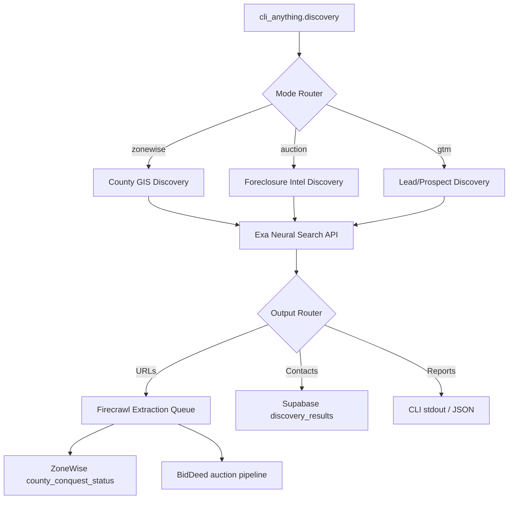

# EXA DISCOVERY HARNESS — SPEC v1.0

> Shared semantic search layer for BidDeed.AI + ZoneWise.AI
> Fills Layer 2 (Search) gap identified from Greg Isenberg's 5-Layer Agent Stack

## Architecture



## Problem Statement

Both BidDeed and ZoneWise manually map data sources per county/domain. 
Exa's neural search discovers GIS portals, zoning PDFs, foreclosure data 
sources, and municipal records autonomously — replacing human research 
with agent research.

## Exa API Integration

```yaml
endpoint: https://api.exa.ai/search
auth: x-api-key header
search_types:
  auto: Default, balances neural + keyword (use for most queries)
  neural: Embeddings-based, best for conceptual discovery
  fast: Sub-350ms, for real-time agent loops
  deep: Agentic multi-hop, 3.5s P50, highest quality
pricing:
  neural_1_25: $0.005/search
  neural_per_page: $0.001 (text/highlights/summary)
  deep_1_25: $0.015/search
  budget_cap: $10/session (COST DISCIPLINE applies)
  estimated_monthly: ~$15-25 for 67-county discovery
```

## CLI Interface

```bash
# ZoneWise: Discover GIS portals for a county
cli_anything.discovery zonewise --county "Orange" --state FL

# ZoneWise: Batch discover all pending counties
cli_anything.discovery zonewise --batch --source fl_counties --status pending

# BidDeed: Find foreclosure data sources for a county
cli_anything.discovery auction --county "Brevard" --state FL

# BidDeed: Discover lien/title search portals
cli_anything.discovery auction --type lien_portals --state FL

# GTM: Find prospects in a vertical
cli_anything.discovery gtm --vertical "FL title companies" --max 25

# All modes support --dry-run and --cost-estimate
cli_anything.discovery zonewise --county "Duval" --dry-run
```

## Harness Phases (HARNESS.md 7-Phase Pipeline)

```yaml
P1_INIT:
  - Load EXA_API_KEY from env/secrets
  - Validate mode (zonewise|auction|gtm)
  - Load county list from Supabase if --batch

P2_QUERY_BUILD:
  zonewise_queries:
    - "{county} County Florida GIS parcel map portal"
    - "{county} County Florida zoning ordinance map"
    - "{county} County Florida property appraiser website"
    - "{county} County Florida building permits portal"
    - "{county} County Florida land development code PDF"
  auction_queries:
    - "{county} County Florida foreclosure auction calendar"
    - "{county} County Florida clerk of court records search"
    - "{county} County Florida tax deed sale"
    - "{county} County Florida lis pendens search"
    - "{county} County Florida property lien search portal"
  gtm_queries:
    - "{vertical} {state} contact email"
    - Uses Exa category: "company" for business discovery

P3_EXA_SEARCH:
  - POST https://api.exa.ai/search
  - type: "auto" (default) or "deep" for batch county expansion
  - contents.highlights.maxCharacters: 500 (token-efficient)
  - numResults: 10 per query
  - includeDomains: [".gov", ".us"] for GIS (boost official sources)
  - Cost tracking per request via costDollars response field

P4_FILTER_RANK:
  - Score results by relevance (highlightScores from Exa)
  - Deduplicate across queries (same URL from multiple queries)
  - Classify: GIS_PORTAL | ZONING_PDF | CLERK_SEARCH | TAX_PORTAL | OTHER
  - Flag official .gov/.us domains as HIGH_CONFIDENCE
  - Discard results with highlightScore < 0.25

P5_FIRECRAWL_HANDOFF:
  - For ZoneWise: Queue discovered URLs to Firecrawl for extraction
  - Output: { url, classification, confidence, county, firecrawl_queued }
  - For Auction: Extract portal details and store access patterns
  - For GTM: Extract contact info from company pages

P6_PERSIST:
  - Supabase table: discovery_results
  - Columns: id, mode, county, state, query, url, title, classification,
    confidence, highlight_text, exa_score, firecrawl_status, created_at
  - Update county_conquest_status.discovery_complete = true
  - Update fl_counties with discovered portal URLs

P7_REPORT:
  - CLI stdout: YAML summary per county
  - Telegram notification on batch completion
  - Cost report: total Exa spend for session
```

## Supabase Migration

```sql
-- Table: discovery_results
CREATE TABLE IF NOT EXISTS discovery_results (
  id UUID DEFAULT gen_random_uuid() PRIMARY KEY,
  mode TEXT NOT NULL CHECK (mode IN ('zonewise', 'auction', 'gtm')),
  county TEXT,
  state TEXT DEFAULT 'FL',
  query TEXT NOT NULL,
  url TEXT NOT NULL,
  title TEXT,
  classification TEXT CHECK (classification IN (
    'GIS_PORTAL', 'ZONING_PDF', 'CLERK_SEARCH', 
    'TAX_PORTAL', 'APPRAISER', 'PERMIT_PORTAL',
    'AUCTION_CALENDAR', 'LIEN_SEARCH', 'COMPANY', 'OTHER'
  )),
  confidence NUMERIC(3,2) DEFAULT 0.00,
  highlight_text TEXT,
  exa_score NUMERIC(5,4),
  firecrawl_status TEXT DEFAULT 'pending' 
    CHECK (firecrawl_status IN ('pending', 'queued', 'scraped', 'failed', 'skipped')),
  cost_dollars NUMERIC(6,4) DEFAULT 0.0000,
  created_at TIMESTAMPTZ DEFAULT NOW(),
  UNIQUE(mode, county, url)
);

-- Index for county lookups
CREATE INDEX idx_discovery_county ON discovery_results(county, mode);
CREATE INDEX idx_discovery_status ON discovery_results(firecrawl_status);

-- RLS
ALTER TABLE discovery_results ENABLE ROW LEVEL SECURITY;
CREATE POLICY "Service role full access" ON discovery_results
  FOR ALL USING (auth.role() = 'service_role');
```

## Exa MCP for Claude Code Sessions

```json
{
  "mcpServers": {
    "exa": {
      "command": "npx",
      "args": ["-y", "mcp-remote", "https://mcp.exa.ai/mcp"],
      "env": {
        "EXA_API_KEY": "${EXA_API_KEY}"
      }
    }
  }
}
```

## Secrets Required

```yaml
EXA_API_KEY: PENDING  # Sign up at exa.ai → Dashboard → API Key
  # Free: $10 credits to start
  # Pro: $49/mo for 8K credits (sufficient for 67-county expansion)
  # Action: Ariel generates key at https://dashboard.exa.ai
```

## Cost Estimate

```yaml
67_county_full_discovery:
  queries_per_county: 5
  total_queries: 335
  exa_cost_per_query: $0.005
  exa_search_total: $1.68
  highlights_per_result: 10
  highlights_total: 3350
  highlights_cost: $3.35
  total_exa_cost: ~$5.03
  firecrawl_follow_up: ~$3.35 (335 page scrapes at Standard)
  grand_total: ~$8.38
  verdict: UNDER $10 SESSION CAP ✅
```

## Eval Assertions (eval/discovery/eval.json)

```yaml
total_assertions: 25
categories:
  activation:  # L1 - Does it run?
    - cli_loads_without_error
    - exa_api_key_validated
    - supabase_connection_verified
    - mode_router_selects_correctly
    - dry_run_returns_cost_estimate
  output_quality:  # L2 - Is output correct?
    - brevard_returns_bcpao_url
    - brevard_returns_realforeclose_url
    - orange_returns_ocpafl_url
    - duval_returns_coj_url
    - gov_domains_ranked_higher
    - duplicate_urls_deduplicated
    - classification_matches_content
    - highlight_score_filter_applied
    - cost_tracking_accurate
    - supabase_insert_succeeds
  integration:  # L3 - Does it chain?
    - firecrawl_queue_populated
    - county_conquest_status_updated
    - telegram_notification_sent
    - batch_mode_processes_all_pending
    - gtm_mode_returns_companies
  edge_cases:
    - handles_county_with_no_results
    - respects_rate_limits
    - retries_on_exa_timeout
    - cost_cap_enforced
    - invalid_county_returns_error
```

## SUMMIT Dispatch

```yaml
task:
  id: DISC-001
  priority: P1
  title: "Deploy Exa Discovery Harness to cli-anything-biddeed"
  repo: breverdbidder/cli-anything-biddeed
  branch: feat/discovery-harness
  
steps:
  1_BLOCKER:
    action: "ESCALATE to Ariel"
    reason: "EXA_API_KEY required — generate at https://dashboard.exa.ai"
    note: "Free $10 credits sufficient for MVP. Pro ($49/mo) for production."
    
  2_MIGRATE:
    action: "Run SQL migration for discovery_results table"
    target: Supabase mocerqjnksmhcjzxrewo
    file: migrations/20260327_discovery_results.sql
    
  3_SCAFFOLD:
    action: "Fork harness from cli-anything-biddeed template"
    create:
      - src/discovery/index.js
      - src/discovery/exa_client.js
      - src/discovery/query_builder.js
      - src/discovery/filter_rank.js
      - src/discovery/persist.js
      - tests/discovery.test.js
      - eval/discovery/eval.json
      - SKILL.md (discovery harness)
    
  4_MCP:
    action: "Add Exa MCP to CLAUDE.md in all repos"
    repos:
      - cli-anything-biddeed
      - brevard-bidder-scraper
      - zonewise-web
    
  5_AUTOLOOP:
    action: "Add eval/discovery/eval.json to AUTOLOOP nightly"
    file: .github/workflows/autoloop.yml
    
  6_WEEKLY_HEALTH:
    action: "Add discovery harness to Sunday weekly-health check"
    staleness: 7 days no commits = alert
    
  7_TEST:
    action: "Run discovery against Brevard (known-good) to validate"
    expected: "Returns bcpao.us, brevardclerk.us, realforeclose.com"
    
  8_BATCH:
    action: "Run discovery --batch for Orange + Duval (next 2 counties)"
    depends_on: EXA_API_KEY

status: BLOCKED on Step 1 (EXA_API_KEY)
estimated_cc_session: 2-3 hours
```

## File Tree (Post-Deploy)

```
cli-anything-biddeed/
├── discovery/
│   ├── SKILL.md
│   ├── src/
│   │   ├── index.js          # CLI entry + mode router
│   │   ├── exa_client.js     # Exa API wrapper with cost tracking
│   │   ├── query_builder.js  # Mode-specific query templates
│   │   ├── filter_rank.js    # Score, dedup, classify
│   │   └── persist.js        # Supabase + Firecrawl queue
│   ├── tests/
│   │   └── discovery.test.js
│   └── eval/
│       └── eval.json         # 25 binary assertions
├── migrations/
│   └── 20260327_discovery_results.sql
```
