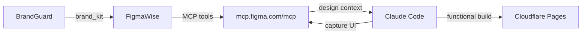

# ── FigmaWise Pipeline (added 2026-03-25) ──

## Figma MCP Integration


## Figma Config
```yaml
mcp: https://mcp.figma.com/mcp (remote, OAuth)
plugin: figma@claude-plugins-official
auth: OAuth (one-time, token persists in ~/.claude/)
tools: extract|implement|capture|variables|audit|write
brand: navy=#1E3A5F, orange=#F59E0B, bg=#020617, font=Inter
rate_limit: Per-minute (paid seat) or 6/mo (free)
```
