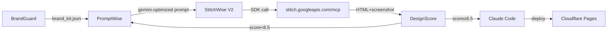

# ── StitchWise V2 Pipeline (added 2026-03-25) ──

## Stitch Integration


## Stitch Config
```yaml
sdk: "@google/stitch-sdk"
mcp: "@_davideast/stitch-mcp proxy"
auth: GEMINI_API_KEY (env)
budget: 300 gen/mo (350 limit - 50 reserve)
circuit_breaker: 3 retries/design
brand: navy=#1E3A5F, orange=#F59E0B, bg=#020617, font=Inter
commands: generate | list | export | dashboard | landing
```
