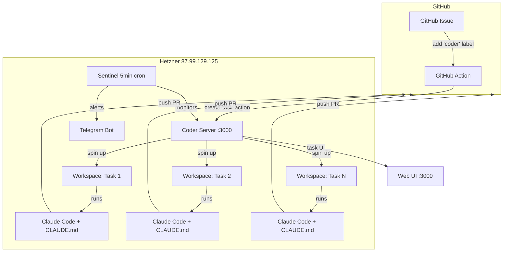

# CODER-ADOPTION.md
## Coder Workspaces — Orchestration Layer for Claude Code Sessions
**Status:** APPROVED — DISPATCH TO SUMMIT  
**Date:** 2026-03-27  
**Owner:** Claude AI Architect  
**Target:** Hetzner 87.99.129.125  
**Cost:** $0 (open source, self-hosted)  
**Eval Rule:** CC NATIVE vs CUSTOM — 1 week parallel, Supabase cc_feature_comparison

---

## 1. WHY ADOPT

```yaml
problem:
  - SUMMIT runs CC sessions on single bare-metal box — no isolation between parallel tasks
  - No web UI for real-time task tracking (only Telegram alerts + GHA logs)
  - GitHub issue → PR requires custom GHA dispatch YAML per repo
  - State bleed risk when running 3+ concurrent CC sessions

solution: Coder Workspaces (coder.com)
  type: open-source, self-hosted
  what_it_does:
    - Spins isolated Docker container PER coding task
    - Built-in web UI for tracking all agent sessions
    - GitHub label trigger → auto-workspace → Claude Code → PR
    - 1,000 free Agent Workspace Builds (Community tier)
    - MCP-compatible — Claude Code has first-class module support

keeps_from_summit:
  - Sentinel self-healing (cron 5min, auto-detect+fix)
  - Telegram alerting pipeline
  - OAuth token management (CLAUDE_OAUTH_B64)
  - Weekly health checks + repo-forensics

replaces_from_summit:
  - Container orchestration (Docker-in-Docker → Coder templates)
  - Task dispatch (GHA workflow_dispatch → GitHub label trigger)
  - Session monitoring (GHA logs → Coder Tasks web UI)
```

---

## 2. ARCHITECTURE



---

## 3. DEPLOYMENT STEPS (SUMMIT DISPATCH)

```yaml
phase_1_install:
  priority: P0
  estimated_time: 30min
  steps:
    - name: "Install Coder via Docker Compose"
      commands:
        - mkdir -p /home/claude/coder && cd /home/claude/coder
        - curl -L https://raw.githubusercontent.com/coder/coder/main/compose.yaml -o docker-compose.yaml
        - "# Update group_add with: getent group docker | cut -d: -f3"
        - "# Set env vars in docker-compose.yaml:"
        - "CODER_ACCESS_URL=http://87.99.129.125:3000"
        - "CODER_TELEMETRY_ENABLE=false"
        - docker compose up -d
      verify:
        - curl -s http://localhost:3000/api/v2/buildinfo | jq .version
    
    - name: "Create admin account"
      commands:
        - "# First visit http://87.99.129.125:3000 — set admin creds"
        - "# Store creds in Supabase secrets table"
      verify:
        - coder login http://87.99.129.125:3000

    - name: "Firewall — restrict Coder UI"
      commands:
        - ufw allow from 0.0.0.0/0 to any port 3000 proto tcp comment 'coder-ui'
        - "# TODO: restrict to Ariel's IP range after testing"

phase_2_template:
  priority: P0
  estimated_time: 45min
  steps:
    - name: "Create Claude Code task template"
      details: |
        Use Coder's Docker task template as base.
        Import from: github.com/coder/coder/examples/templates/tasks-docker
        Customize main.tf:
      terraform_additions: |
        # --- Claude Code Module ---
        module "claude-code" {
          source  = "registry.coder.com/coder/claude-code/coder"
          version = "4.0.0"
          agent_id = coder_agent.main.id
          workdir  = "/home/coder/project"
          # Use OAuth token from SUMMIT secret
          claude_code_oauth_token = var.claude_oauth_token
          claude_code_version     = "1.0.82"
          agentapi_version        = "v0.6.1"
        }

        data "coder_task" "me" {}
        
        resource "coder_ai_task" "task" {
          app_id = module.claude-code.task_app_id
        }

        variable "claude_oauth_token" {
          type      = string
          sensitive = true
        }
      env_inject:
        - CLAUDE_OAUTH_TOKEN: "from CLAUDE_OAUTH_B64 secret (base64 -d)"
        - GITHUB_TOKEN: "PAT4 ghp_GspUZr...2E35r7"
        - NODE_ENV: production
        - NPM_CONFIG_PREFIX: /home/coder/.npm-global
    
    - name: "Inject CLAUDE.md into template"
      details: |
        Template Dockerfile must:
        1. Clone target repo into /home/coder/project
        2. Ensure CLAUDE.md is at repo root (already in all 5 repos)
        3. Install plugins: Context7 + CC Status Line
        4. Set auto-mode

phase_3_github_integration:
  priority: P0
  estimated_time: 30min
  repos:
    - breverdbidder/cli-anything-biddeed  # PILOT
  steps:
    - name: "Add GHA workflow to pilot repo"
      file: .github/workflows/coder-task.yml
      content: |
        name: Coder Task from Issue
        on:
          issues:
            types: [labeled]
        permissions:
          issues: write
        jobs:
          coder-create-task:
            runs-on: ubuntu-latest
            if: github.event.label.name == 'coder'
            steps:
              - name: Create Coder Task
                uses: coder/create-task-action@v0
                with:
                  coder-url: ${{ secrets.CODER_URL }}
                  coder-token: ${{ secrets.CODER_TOKEN }}
                  coder-organization: "default"
                  coder-template-name: "biddeed-claude-code"
                  coder-task-name-prefix: "gh-task"
                  coder-task-prompt: |
                    Read the GitHub issue at ${{ github.event.issue.html_url }} using gh CLI.
                    Follow CLAUDE.md directives. Load TODO.md if present.
                    Implement the fix, run tests, commit with descriptive message.
                    Open a PR with summary of changes. Do NOT wait for feedback.
                  github-user-id: ${{ github.event.sender.id }}
                  github-issue-url: ${{ github.event.issue.html_url }}
                  github-token: ${{ github.token }}
                  comment-on-issue: true
    
    - name: "Add GitHub secrets to pilot repo"
      secrets:
        CODER_URL: "http://87.99.129.125:3000"
        CODER_TOKEN: "# generated from coder tokens create"

phase_4_sentinel_integration:
  priority: P1
  estimated_time: 20min
  steps:
    - name: "Add Coder health check to sentinel-patrol.sh"
      check: |
        # Coder server health
        CODER_HEALTH=$(curl -s -o /dev/null -w "%{http_code}" http://localhost:3000/api/v2/buildinfo)
        if [ "$CODER_HEALTH" != "200" ]; then
          echo "CODER_DOWN"
          docker compose -f /home/claude/coder/docker-compose.yaml restart
          send_telegram "⚠️ Coder server restarted"
        fi
    
    - name: "Add to weekly-health.yml"
      addition: |
        - name: Coder Workspaces Status
          run: |
            ACTIVE=$(curl -s http://localhost:3000/api/v2/workspaces?status=running | jq '.count')
            echo "Active Coder workspaces: $ACTIVE"
    
    - name: "Sentinel auto-recovery patterns"
      patterns:
        - coder_oom: "docker compose restart coder"
        - workspace_stuck: "coder workspace stop <id> && coder workspace start <id>"
        - postgres_full: "docker exec coder-db vacuumdb --all"
```

---

## 4. EVAL PLAN (CC NATIVE vs CUSTOM)

```yaml
eval_duration: 7 days
pilot_repo: cli-anything-biddeed
method: Same 5 GitHub issues dispatched to BOTH systems

supabase_table: cc_feature_comparison
columns:
  - id: uuid
  - system: text  # 'coder' | 'summit'
  - task_description: text
  - wall_clock_seconds: int
  - token_cost_usd: numeric(10,4)
  - quality_score: int  # 1-10, manual review
  - errors_count: int
  - pr_merged: boolean
  - created_at: timestamptz

scoring:
  metrics: [wall_clock, token_cost, quality, errors, pr_merged]
  winner_threshold: "4 of 5 metrics"
  adopt_score: ">=80 ADOPT, 60-79 EVAL, <40 REJECT"

rollout_if_adopt:
  week_2: [brevard-bidder-scraper, zonewise-web]
  week_3: [swimsquad-ai, everest-nexus]
  week_4: [swimsquad-agents]
  summit_role: "Fallback + Sentinel only (no direct dispatch)"
```

---

## 5. ROLLBACK PLAN

```yaml
rollback_triggers:
  - Coder server unstable >3 restarts/day
  - Workspace build failures >50%
  - Token cost increase >20% vs SUMMIT baseline
  - Quality score <6 average

rollback_steps:
  1: Stop Coder Docker containers
  2: Re-enable SUMMIT dispatch workflows in all repos
  3: Remove 'coder' label trigger from GHA
  4: Log rollback reason to Supabase insights
  5: Telegram alert "Coder rollback — SUMMIT restored"

coexistence: |
  SUMMIT remains installed and functional throughout eval.
  Sentinel monitors BOTH systems. No data loss on rollback.
```

---

## 6. RESOURCE BUDGET

```yaml
hetzner_87.99.129.125:
  current_usage:
    - biddeed-cliproxy: ~200MB RAM
    - summit_dispatch: ~150MB RAM
    - sentinel: ~50MB RAM
  
  coder_addition:
    - coder_server: ~500MB RAM
    - postgres: ~200MB RAM
    - per_workspace: ~300MB RAM each
    - max_concurrent: 3 workspaces (stay under 4GB total)
  
  limits:
    - max_concurrent_workspaces: 3
    - workspace_timeout: 2h (auto-stop idle)
    - disk_per_workspace: 5GB
    - total_coder_disk: 20GB

cost: $0/month additional
  - Coder: open source, self-hosted
  - Claude Code: Max plan (unlimited)
  - Docker: already installed
  - 1,000 free workspace builds (Community tier)
```

---

## 7. SUMMIT DISPATCH INSTRUCTIONS

```yaml
dispatch_target: hetzner-87.99.129.125
dispatch_mode: SSH → execute sequentially
session_budget: $10 max (mostly infra commands, minimal LLM)

task_sequence:
  1: Execute phase_1_install
  2: Execute phase_2_template  
  3: Execute phase_3_github_integration (pilot repo only)
  4: Execute phase_4_sentinel_integration
  5: Create Supabase cc_feature_comparison table
  6: Create test issue in cli-anything-biddeed with 'coder' label
  7: Verify end-to-end: issue → workspace → Claude Code → PR
  8: Screenshot Coder UI → Telegram confirmation

success_criteria:
  - Coder server accessible at :3000
  - Template created with Claude Code module
  - Test issue auto-dispatched to workspace
  - PR opened by Claude Code from within Coder workspace
  - Sentinel detects and monitors Coder health
  - Telegram confirmation sent

failure_handling:
  - Log all errors to sentinel_runs table
  - If install fails: report blockers, do NOT retry >3 times
  - If template fails: fall back to manual template creation docs
  - Escalate to Ariel ONLY if: OAuth token issue or Hetzner resource limit
```

---

## 8. POST-DEPLOYMENT MEMORY UPDATE

```yaml
memory_edit_on_success: |
  CODER WORKSPACES (Mar 27 2026): Deployed on Hetzner 87.99.129.125:3000.
  Open-source orchestration for Claude Code. Per-task Docker isolation.
  GitHub 'coder' label → auto-workspace → CC → PR. Template: biddeed-claude-code.
  1,000 free builds. Sentinel monitors health. SUMMIT=fallback.
  Eval: cc_feature_comparison table, 7-day pilot on cli-anything-biddeed.
  Repos: Phase rollout weeks 2-4 if ADOPT (>=80 score).
```
