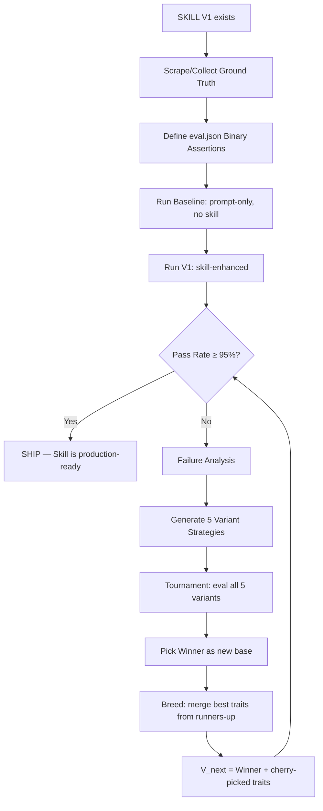
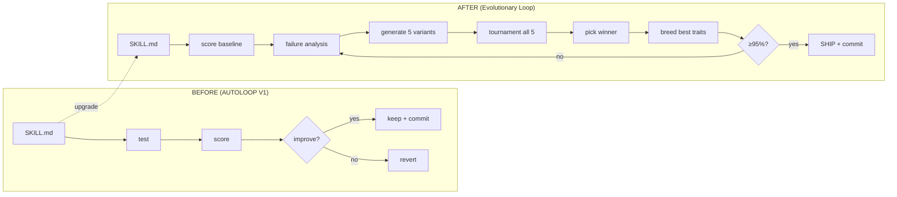

# EVOLUTIONARY-SKILL-LOOP.md
> Adopted from Yaron Been's eval tournament pattern. Deployed to all cli-anything harnesses.  
> Supersedes single-mutation AUTOLOOP for skill optimization.

## Core Flow



## Pipeline Stages

```yaml
stages:
  1_ground_truth:
    what: Collect real-world data for the skill's domain
    sources:
      zonewise: Supabase zoning_assignments verified rows
      auction: Supabase historical_auctions + BCPAO cross-check
      reports: Generated reports vs manual screenshot verification
    rule: NEVER use synthetic/invented data. Real only.

  2_eval_definition:
    what: Write eval.json with 25 binary assertions per skill
    location: "{harness}/eval/{skill_name}/eval.json"
    format:
      - id: "plan_count_correct"
        input: "<real scraped data>"
        expected: true
        assertion: "Output contains exactly N plans"
      - id: "no_hallucinated_values"
        input: "<real scraped data>"
        expected: true
        assertion: "Every numeric value traceable to source"
    minimum_assertions: 25
    types:
      - correctness: Does output match ground truth?
      - completeness: Are all expected fields present?
      - no_hallucination: Are all claims evidence-backed?
      - schema_compliance: Does output match required structure?
      - edge_cases: Handles nulls, missing data, ambiguous inputs?

  3_baseline_run:
    what: Run same task with raw prompt, no SKILL.md
    purpose: Measure lift that skill provides
    output: "eval/{skill_name}/baseline_score.json"

  4_skill_v1_run:
    what: Run task with current SKILL.md
    output: "eval/{skill_name}/v1_score.json"
    gate: "If V1 ≥ 95% → SHIP. Else → stage 5."

  5_failure_analysis:
    what: Categorize every failed assertion
    pattern_categories:
      - missing_evidence: No source citation for claim
      - schema_mismatch: Output structure wrong
      - hallucination: Value not in source data
      - ambiguity: Annual vs monthly, inclusive vs exclusive
      - edge_case: Null handling, empty inputs
    output: "eval/{skill_name}/failure_analysis.json"

  6_variant_generation:
    what: Branch into 5 variant strategies
    variants:
      A: Stricter evidence rules (every claim needs source quote)
      B: Better edge-case detection (null guards, fallback defaults)
      C: Simplified output schema (fewer fields, clearer structure)
      D: Domain-specific focus (heavier prompting on known weak areas)
      E: Aggressive gotcha mining (adversarial self-check in skill)
    storage: "eval/{skill_name}/variants/v{N}_{A-E}.md"
    rule: Each variant modifies ONLY its strategy area. Base stays same.

  7_tournament:
    what: Run all 5 variants against same eval.json
    output: "eval/{skill_name}/tournament_results.json"
    format:
      variant_a: { pass_rate: 0.84, failures: ["id1", "id5"] }
      variant_b: { pass_rate: 0.92, failures: ["id3"] }
      variant_c: { pass_rate: 0.96, failures: ["id22"] }
      variant_d: { pass_rate: 0.88, failures: ["id1", "id9"] }
      variant_e: { pass_rate: 0.80, failures: ["id1", "id5", "id12"] }

  8_breed:
    what: Winner becomes base. Cherry-pick best traits from runners-up.
    rule: |
      1. Winner (highest pass_rate) = new SKILL.md base
      2. For each remaining failure in winner:
         - Check if ANY other variant passed that assertion
         - If yes: extract that variant's strategy for that area
         - Merge into winner
      3. Result = V_next SKILL.md
    output: "SKILL.md (overwritten)"

  9_convergence_check:
    gate: "V_next ≥ 95% → SHIP"
    max_iterations: 5
    fallback: "If 5 generations without 95%, ship best + flag for human review"
```

## GHA Integration (autoloop.yml upgrade)

```yaml
# .github/workflows/autoloop.yml
name: Evolutionary Skill Loop
on:
  schedule:
    - cron: '0 7 * * *'  # 2AM EST nightly
  workflow_dispatch:
    inputs:
      skill_name:
        description: 'Skill to optimize'
        required: true
      max_generations:
        description: 'Max evolution generations'
        default: '3'

jobs:
  evolve:
    runs-on: ubuntu-latest
    steps:
      - uses: actions/checkout@v4

      - name: Ground Truth Check
        run: python scripts/eval_runner.py verify-ground-truth ${{ inputs.skill_name }}

      - name: Baseline Score
        run: python scripts/eval_runner.py baseline ${{ inputs.skill_name }}

      - name: Current Skill Score
        run: python scripts/eval_runner.py score ${{ inputs.skill_name }}

      - name: Evolve Loop
        run: |
          python scripts/eval_runner.py evolve \
            --skill ${{ inputs.skill_name }} \
            --variants 5 \
            --max-generations ${{ inputs.max_generations }} \
            --target-pass-rate 0.95 \
            --breed-on-plateau

      - name: Report to Supabase
        run: python scripts/eval_runner.py report ${{ inputs.skill_name }}

      - name: Telegram Notification
        if: always()
        run: python scripts/notify.py "AUTOLOOP ${{ inputs.skill_name }}: $(cat eval/${{ inputs.skill_name }}/latest_score.json | jq -r '.pass_rate')"
```

## eval_runner.py Commands

```yaml
commands:
  verify-ground-truth:
    desc: Validate ground truth data exists and is fresh
    exits: 1 if stale (>30 days) or missing

  baseline:
    desc: Run eval.json assertions with raw prompt (no skill)
    output: baseline_score.json

  score:
    desc: Run eval.json assertions with current SKILL.md
    output: v{N}_score.json

  evolve:
    desc: Full evolutionary loop
    params:
      --variants: Number of strategy variants per generation (default 5)
      --max-generations: Cap on evolution cycles (default 3)
      --target-pass-rate: Stop when achieved (default 0.95)
      --breed-on-plateau: Merge traits when no single variant improves
    behavior: |
      For each generation:
        1. Analyze failures in current best
        2. Generate N variant SKILL.md files
        3. Score all variants
        4. If winner > current best: winner becomes base
        5. Breed: merge runner-up traits into winner
        6. If target met: stop + commit
        7. If plateau (no improvement 2 gens): force breed + add new strategy
      On success: git commit + push updated SKILL.md
      On regression: git reset, keep previous best

  report:
    desc: Push results to Supabase skill_evolution table
    fields: [skill_name, generation, pass_rate, failures, variant_used, timestamp]
```

## Supabase Table

```sql
CREATE TABLE IF NOT EXISTS skill_evolution (
  id UUID DEFAULT gen_random_uuid() PRIMARY KEY,
  skill_name TEXT NOT NULL,
  generation INTEGER NOT NULL,
  variant TEXT,
  pass_rate NUMERIC(5,4) NOT NULL,
  baseline_rate NUMERIC(5,4),
  failures JSONB DEFAULT '[]',
  failure_analysis JSONB DEFAULT '{}',
  bred_from TEXT[],
  is_production BOOLEAN DEFAULT false,
  created_at TIMESTAMPTZ DEFAULT now()
);

CREATE INDEX idx_skill_evolution_lookup
  ON skill_evolution(skill_name, generation DESC);
```

## SUMMIT Dispatch Template

```yaml
dispatch:
  repo: breverdbidder/cli-anything-biddeed
  branch: feat/evolutionary-autoloop
  task: |
    Upgrade AUTOLOOP from single-mutation to evolutionary tournament.
    
    1. Read EVOLUTIONARY-SKILL-LOOP.md (this file) — it is the spec.
    2. Upgrade scripts/eval_runner.py:
       - Add `evolve` command with variant generation + tournament + breeding
       - Add `verify-ground-truth` command
       - Keep existing `score` command backward-compatible
    3. Update .github/workflows/autoloop.yml per spec above
    4. Create Supabase migration: migrations/20260325_skill_evolution.sql
    5. Test with zonewise eval.json (25 assertions already exist)
    6. Commit, push, report results
    
  constraints:
    - $10 session max
    - ONE attempt per approach
    - Use existing eval.json files as-is
    - Do NOT modify SKILL.md files during implementation (only the loop modifies them)
    - Branch feat/evolutionary-autoloop, not main
  
  success_criteria:
    - eval_runner.py evolve runs end-to-end on zonewise
    - autoloop.yml triggers on schedule + manual dispatch
    - skill_evolution table created in Supabase
    - Telegram notification fires with pass_rate
```

## Relationship to Existing Systems



## Rules

```yaml
rules:
  - NEVER invent eval data. Ground truth only.
  - NEVER mark shipped until pass_rate verified in CI.
  - Max 5 generations per nightly run (cost discipline).
  - Each variant generation uses ULTRA_CHEAP tier (DeepSeek/Gemini).
  - Tournament scoring uses same LLM for consistency.
  - Git commit on improvement, git reset on regression. No exceptions.
  - Breeding merges STRATEGIES not raw text. Think gene splicing, not copy-paste.
  - Plateau detection: if 2 generations show <1% improvement, force new strategy injection.
```
