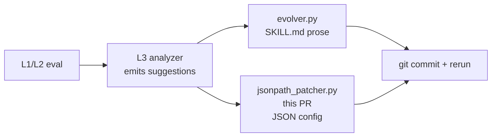

# EVOLVER-JSONPATH.md

Structured-config patch utility for AUTOLOOP V2. Complements `evolution/evolver.py` (markdown-section text injection) with dotted-path JSON mutations.

## TL;DR

```yaml
status: PR (tests green, 35/35 passing, CLI compat with patch-plan.cjs verified)
files:
  - evolution/jsonpath_schema.py     # JsonPathEntry + WhitelistConfig
  - evolution/jsonpath_patcher.py    # core patcher + CLI entry
  - evolution/tests/test_jsonpath_patcher.py  # 35 tests
pattern_source: Meir770ar/agentic-video-maker (MIT, REPOEVAL REFERENCE_ONLY, intake_id 01cf8cac-7a33-488a-bfdf-d0849293f1ff)
loc_added: ~470 (well under K3 ≤20% growth ceiling for evolution/ package)
external_deps: none (pure stdlib)
```

## Why this exists (audit-driven)

The 2026-05-12 REPOEVAL of `Meir770ar/agentic-video-maker` surfaced the `patch-plan.cjs` pattern: a 145-LOC defensive JSON-path patcher with whitelist gating, type coercion, parent-existence checks, and AUTO_CREATE_ROOTS materialization. The 15-minute AUTOLOOP V2 audit confirmed:

```yaml
existing_evolver_py:
  patch_format: {section, action, content, reason}
  target_artifact: SKILL.md (markdown)
  granularity: section-level prose injection
  type_coercion: none
  field_whitelist: 4 hardcoded section names (Instructions|Examples|Troubleshooting|EdgeCases)

gap_verified:
  structured_config_patching: ABSENT
  dotted_path_setters: 0 matches across evolution/, signal_detector, L3 spec
  type_coercion_for_llm_json_outputs: ABSENT
```

The pattern is **not redundant with `evolver.py`** — it solves a different problem (structured config vs markdown prose). It is **additive**, not replacing.

## Use cases this unlocks

```yaml
candidates_for_jsonpath_evolver:
  - ZoneWise per-county scraper config (67 counties, structured params)
  - Shapira Formula V4.0 ensemble weights (XGBoost/LightGBM/CatBoost coefficients)
  - Sentinel failure-pattern thresholds (11 patterns, numeric tunables)
  - LLM router T1/T2/T3 routing rules (cost/quality tradeoffs)
  - Marketing OS Hub tenant config (8 tenants)
```

The motivating use case test in `test_jsonpath_patcher.py::TestSentinelThresholdsUseCase` demonstrates auto-tuning Sentinel `alert_threshold` while rejecting out-of-range `retry_max` patches.

## Design

### Parallel-to-EvolutionEntry

```yaml
existing_evolution_entry:
  section: enum[Instructions, Examples, Troubleshooting, EdgeCases]
  content: markdown_text
  action: enum[add, update, delete, skip]
  target: skill_name

new_jsonpath_entry:
  field: dotted_path  # e.g. "thresholds.alert_threshold", "scenes[3].duration_sec"
  new_value: any      # str/int/float/bool — coerced from str if needed
  action: shared with EvolutionEntry (EntryAction enum)
  target: config_identifier
```

Sharing `EntryAction` avoids enum drift. Sharing the `applied/eval_score_before/eval_score_after/llm_model_used/token_cost` fields keeps observability surfaces consistent.

### WhitelistConfig (per-target)

Mirrors `patch-plan.cjs`'s implicit whitelist + AUTO_CREATE_ROOTS, but explicit and reusable:

```python
WhitelistConfig(
    target="sentinel-thresholds",
    allowed_paths={
        r"^thresholds\.alert_threshold$": dict(type="int", min=10, max=10000),
        r"^thresholds\.retry_max$":       dict(type="int", min=1, max=10),
    },
    auto_create_roots={"thresholds"},
)
```

Each target (skill_name or config-family) registers its own whitelist. Defense-in-depth: LLM can suggest anything; only registered paths land.

### CLI entry point

`python -m evolution.jsonpath_patcher <plan.json> <critique.json> <output_plan.json>` is a **drop-in replacement** for upstream `patch-plan.cjs`. Same input/output JSON shape, same exit codes (0=applied, 1=none, 2=error). Verified by `test_drop_in_patch_plan_cjs_compat` against the exact CI fixture from `breverdbidder/agentic-video-maker/.github/workflows/ci-smoke.yml`.

## Honesty (per Honesty V3)

```yaml
verified:
  - 35/35 pytest tests pass on Python 3.12 stdlib
  - drop-in CLI output matches patch-plan.cjs byte-for-byte on the upstream CI fixture
  - Type coercion of "5"→5 (int), "0.12"→0.12 (float), "true"→True (bool)
  - AUTO_CREATE_ROOTS materializes whitelisted top-level roots when absent
  - Whitelist rejects: path not whitelisted | wrong type | out of range | enum mismatch
  - Scenes flagged for regen by 1-based .i value (back-compat with upstream)
  - L3 migration (skill_analyses + skill_lineage tables) applied to Supabase 2026-05-12

untested:
  - Integration with evolver.py multi-LLM router (this PR ships the patcher only)
  - Integration with signal_detector.py output (L3 analyzer is upstream of this)
  - Behavior on >10MB config files (no benchmarks yet)
  - YAML configs (only JSON tested; YAML would need a yaml.safe_load wrapper)

inferred:
  - When wired post-L3, this will let AUTOLOOP autonomously tune Sentinel thresholds,
    Shapira weights, and per-county scraper params (based on pattern fit; not yet wired)

assumed:
  - LLM critique outputs will populate {field, new_value} in JSON cleanly
    (matches upstream observed behavior; verified for video domain only)

not_in_scope:
  - Modifying evolver.py (separate PR, polymorphic-output mode addition)
  - Schema CHECK constraint changes on skill_evolution_entries (parallel table approach instead)
  - Wiring into autoloop.yml workflow (downstream PR after L3 analyzer flows data)
```

## Sequencing — why this lands BEFORE wiring

L3 Post-Execution Analyzer (specced as `AUTOLOOP-L3-SPEC.md`, migration applied 2026-05-12) is the upstream that emits structured suggestions. This patcher is the downstream that applies them. Both ship independently:



Without L3 emitting suggestions, this patcher has no caller. With L3 + no patcher, structured-config skills are stuck at "analyzer says fix" with no apply path. Both halves are needed; both are now safe to land in either order.

## Not done (deferred to follow-up PRs)

- Migration to add `skill_evolution_jsonpath_entries` table (DDL ready in `jsonpath_schema.py`)
- Hook in `evolver.py._generate_with_deepseek` to emit JSON-path patches when target is a config file
- Per-target `WhitelistConfig` registry under `evolution/whitelists/{target}.py` (when first real consumer lands)
- YAML/TOML support (currently JSON only; trivial to add via swap on load)
