# CFO Bookkeeping SOP

**Status:** canonical. **Owner:** Ariel Shapira. **Authored:** 2026-08-31.
**Scope:** internal ledger infrastructure only (`finance.*` schema, `winnerdata.billable_ff_events`).
This document does not authorize contacting or invoicing Mariam directly — that
happens after Ariel reviews the numbers this pipeline produces.

---

## 1. Chart of accounts

`finance.entities` is the chart of accounts. Every ledger row (`expense_ledger`,
`revenue_ledger`, `invoices`) carries an `entity_code` FK into this table.

| code | name |
|---|---|
| `biddeed` | BidDeed.AI |
| `zonewise` | ZoneWise.AI |
| `winnerdata` | Winner Data |
| `protection_partners` | Protection Partners (Mariam) |
| `everest_capital` | Everest Capital USA / Development |

Add a new entity with a plain `INSERT INTO finance.entities (code, name) VALUES (...)`
— no migration required, it's a lookup table, not an enum.

---

## 2. The FF → revenue → invoice pipeline

```mermaid
graph LR
    A[county clerk auction] -->|FF_DAILY_SOP.md pipeline| B[winnerdata.ff_batch_leads]
    B -->|qa_status = CONTACT_ENRICHED only| C[winnerdata.winnerdata_billable_backfill]
    C --> D[winnerdata.billable_ff_events]
    D -->|AFTER INSERT trigger, WHEN monetization_tier_met| E[finance.revenue_ledger status=pending]
    E -->|finance.generate_invoice per period| F[finance.invoices status=draft]
    F -->|Ariel reviews, sends| G[Mariam / Protection Partners]
    G -.->|payment received, manual today| H[finance.revenue_ledger status=paid]
```



### 2.1 Billability gate

A `winnerdata.ff_batch_leads` row becomes billable when
**`qa_status = 'CONTACT_ENRICHED'`** — this is the only status marked
`Billable: Yes` in `docs/canon/FF_DAILY_SOP.md` section 2. It already encodes
identity resolution *and* DNC/litigator compliance screening (at least one
fully compliant contact line), which is a stricter and more correct gate than
counting how many of `principal_home_address` / phone / email are non-null.

Do not resurrect a raw field-presence ("2-of-3") heuristic as the billability
rule — it was checked against live data on 2026-08-31 and it overcounts
(15 rows) versus the documented `qa_status` gate (13 rows) because it doesn't
account for DNC-blocked or unresolved-identity cases that still happen to
have two populated fields.

### 2.2 Pricing models (both preserved, never collapsed to one)

| Model | Formula | Status |
|---|---|---|
| **Scenario A** | $9.00 delivery fee + $180.00 success fee on bind | **Active.** Mariam's POC is delivery-only right now — no bind has happened yet (`bound_at IS NULL` on every row), so only the $9.00 delivery fee is billed per FF today. |
| **Scenario B** | $12.50 flat fee per FF | Tracked for comparison only, not currently billed. |

Both totals are always computable from `winnerdata.billable_ff_events` directly,
and side-by-side via `winnerdata.v_billable_ff_comparison`. `finance.revenue_ledger`
rows are written using Scenario A math (see `finance.fn_billable_ff_events_to_revenue_ledger`);
the Scenario B total is recorded in the row's `notes` field for reference, not billed.

If/when Scenario B (or a bind fee under Scenario A) becomes the live pricing
model, update `finance.fn_billable_ff_events_to_revenue_ledger` — do not
hand-adjust historical `revenue_ledger` rows to match a new model
retroactively.

### 2.3 Object reference

| Object | What it does |
|---|---|
| `winnerdata.winnerdata_billable_backfill()` | One-time/re-runnable backfill: inserts a `billable_ff_events` row for every `ff_batch_leads` row with `qa_status='CONTACT_ENRICHED'` that doesn't already have one. Idempotent via a composite FK + unique index on `(source_batch_date, source_auction_id)` referencing `ff_batch_leads(batch_date, auction_id)`. |
| `trg_billable_ff_events_revenue_ledger` (on `winnerdata.billable_ff_events`) | Fires on every future insert where `monetization_tier_met = true`. Writes one `finance.revenue_ledger` row, `status='pending'`, `entity_code='protection_partners'`, `source='ff_billing'`, `ref_table`/`ref_id` pointing back to the `billable_ff_events` row. |
| `finance.generate_invoice(entity_code, customer, period_start, period_end)` | Rolls up all `status='pending'` `revenue_ledger` rows for that entity/customer/period into one `finance.invoices` row (`status='draft'`), flips those rows to `status='invoiced'`. Raises an exception (does not silently no-op) if there is nothing pending in that period — a genuinely empty period is a config error, not a valid zero-row invoice. |
| `finance.record_expense(...)` | Manual expense entry. `source='manual'`. The only working expense-ingestion path today. |

---

## 3. Operating cadence

| Cadence | Action |
|---|---|
| **Daily** (after the FF batch pipeline runs, per `FF_DAILY_SOP.md`) | Run `select * from winnerdata.winnerdata_billable_backfill();` — safe to run every day, it only inserts new qualifying rows. The revenue_ledger trigger fires automatically on each insert; no separate step needed. |
| **Weekly** | Spot-check `finance.revenue_ledger` against `winnerdata.billable_ff_events` for drift — join on `ref_id`, confirm counts and dollar totals match. Log any known/committed recurring costs (SaaS subscriptions, API budgets) via `finance.record_expense(..., is_recurring=true, recurrence_period='monthly')` if not already entered. |
| **Monthly** | Ariel calls `finance.generate_invoice('protection_partners', 'Protection Partners (Mariam)', <period_start>, <period_end>)`. Review the resulting `finance.invoices` row (`status='draft'`). Only after Ariel's explicit review does the invoice move to `sent_at`/actually reach Mariam — this SOP does not automate that step. |
| **As needed** | Any one-off expense: `select finance.record_expense(entity_code, vendor, category, amount_cents, incurred_on, notes);`. |

No cron job runs any of this automatically yet — every step above is a
manual (or SUMMIT-dispatched) SQL call. Automating the daily backfill into a
scheduled workflow is a reasonable next step but is explicitly **not** built
by this SOP; build it only when asked, per the Karpathy K2/K3 discipline in
`CLAUDE.md` (no speculative automation).

---

## 4. Manual gates — Ariel-only, not agent-executable

These two steps require Ariel's own action and cannot be completed by an
agent under any circumstance, per this pipeline's non-goals:

1. **Connect Stripe for Protection Partners billing.** Ariel supplies a
   Stripe secret key + webhook signing secret (via Claude.ai Settings →
   Connectors, or as a GitHub/Supabase-vault secret). Until then,
   `supabase/functions/finance-stripe-revenue-webhook/index.ts` stays an
   inert scaffold — it does not call Stripe, is not registered with any
   `deploy-*.yml` workflow, and must not be treated as live. This is a
   **separate** integration from the already-live
   `supabase/functions/stripe-webhook/` (BidDeed.AI S5-report checkout,
   `entity_code='biddeed'`) — do not conflate the two or assume the existing
   connection covers Protection Partners billing.

2. **Connect a bank feed (Plaid).** Ariel links a bank account via the Plaid
   Developer Tools connector he has available and supplies
   `PLAID_CLIENT_ID` / `PLAID_SECRET` / `PLAID_ACCESS_TOKEN`. Until then,
   `scripts/finance_plaid_expense_ingest.py` is a scaffold whose `main()`
   raises immediately — it does not attempt any Plaid API call. The only
   working expense path until this is connected is
   `finance.record_expense()` (manual entry).

No paid bookkeeping SaaS (QuickBooks, Xero, Bench, Pilot, etc.) is introduced
anywhere in this pipeline, per Ariel's 2026-08-31 instruction — the ledger is
native Supabase tables plus these functions.

---

## 5. Verification queries (re-run these, don't trust this doc's numbers)

```sql
-- Billable events and both pricing totals
select count(*), 
       sum(scenario_a_delivery_fee_cents + case when bound_at is not null then scenario_a_success_fee_cents else 0 end) as scenario_a_cents,
       sum(scenario_b_flat_fee_cents) as scenario_b_cents
from winnerdata.billable_ff_events where source_batch_date is not null;

-- Revenue ledger status breakdown
select status, count(*), sum(amount_cents) from finance.revenue_ledger where source='ff_billing' group by status;

-- Checkpoint history
select checkpoint, status, evidence, updated_at from finance.cfo_checkpoints order by updated_at;
```
