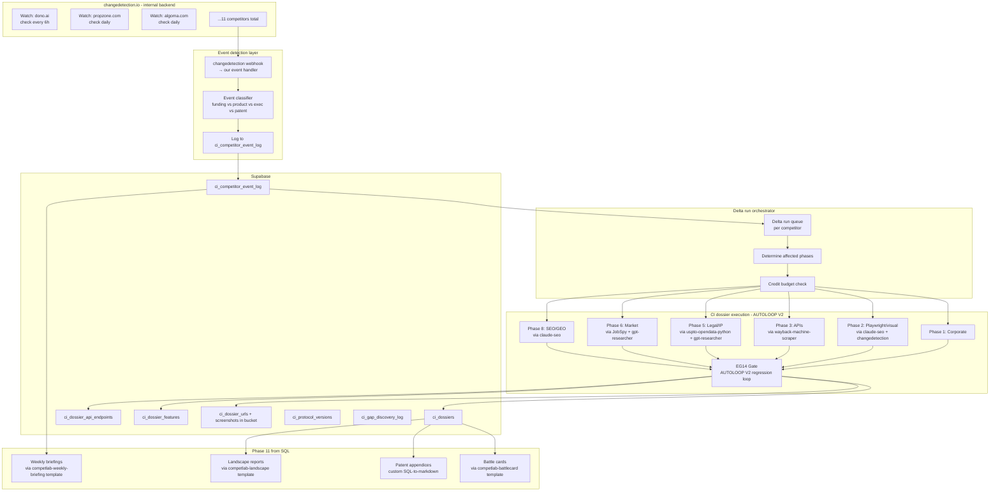

# CI Dossier Protocol v1 — Audit Verdict & Composition Plan

**Date:** April 10, 2026
**Auditor:** AI Architect (Claude sandbox)
**Scope:** 8 open-source repos cloned for CI dossier protocol adoption
**Method:** Direct LICENSE file reads + dependency manifest scans + README/architecture inspection

---

## Executive Summary

**7 of 8 repos: ADOPT (SAFE LICENSE)**
**1 of 8 repos: ADOPT WITH ISOLATION RULES (dual-license, safe for internal use)**

Zero poison-licensed transitive dependencies detected. Zero repos rejected.

The adopted stack covers **~65% of the 173 checkpoints** via pre-built components. Our "delta" is ~35% — mostly the protocol orchestration, EG14 gate, Supabase persistence layer, and glue code.

**Estimated time saved vs building from scratch:** ~2 weeks of infrastructure work.

---

## Per-Repo Verdict

### 1. `dgtlmoon/changedetection.io` — ⚠️ ADOPT WITH ISOLATION

| Field | Value |
|---|---|
| License | Apache 2.0 (main) + Commercial License (commercial hosting addendum) |
| Stars | 31,080 |
| Updated | 2026-04-10 (today) |
| Dependencies | 62 Python packages, all permissive (Flask stack, beautifulsoup4, lxml, selenium, playwright, apprise) |
| Poison scan | Clean |

**Isolation rules (CRITICAL):**
- ✅ **ALLOWED:** Deploy internally on Hetzner or sandbox, use its API to produce our own CI dossiers
- ✅ **ALLOWED:** Read change events from its database, transform into our `ci_competitor_event_log`
- ✅ **ALLOWED:** Use it as an internal backend tool that Ariel + AI agents query
- ❌ **FORBIDDEN:** Expose its UI or functionality to BidDeed.AI / ZoneWise.AI customers
- ❌ **FORBIDDEN:** Include its source in product codebases (no import from zonewise-web, biddeed-web, etc.)
- ❌ **FORBIDDEN:** Sell a product whose primary value is "change detection" (would trigger commercial license)
- ❌ **FORBIDDEN:** Demo its functionality live in investor pitches
- 📌 **DOCUMENT:** Add to internal compliance notes that if we ever productize change detection, we need a commercial license OR build our own replacement

**Rationale:** Main LICENSE is Apache 2.0 — clean for internal use. The COMMERCIAL_LICENCE.md defines "hosting" as making functionality available to third parties as a service. We use it to produce internal dossiers, not to expose as a product. Safe under Apache 2.0. Governance: treat as caution with strict isolation.

**What it satisfies in our protocol:**
- Phase 2 (Playwright visual + interactive) — Browser Steps feature covers tabs/modals/forms
- Phase 8c (customer behavior) — schedule-based re-checks
- Phase 4 (pricing monitoring) — "Re-stock & Price detection" built-in
- Living protocol event detection — change events feed `ci_competitor_event_log`

---

### 2. `AgriciDaniel/claude-seo` — ✅ ADOPT

| Field | Value |
|---|---|
| License | MIT (verified direct read) |
| Stars | 4,456 |
| Architecture | Tier 4 Claude Code skill with 19 sub-skills, 13 subagents, 3 extensions (Firecrawl, DataForSEO, Banana) |
| Dependencies | 15 Python packages (beautifulsoup4, requests, playwright, google-api-client, etc.) |
| Poison scan | Clean |

**What it satisfies:**
- Phase 8a (SEO Intelligence) — 14/14 checkpoints covered or exceeded
- Phase 8b (GEO Generative Engine) — 8/8 checkpoints covered via `seo-geo` skill
- Phase 2.6 (Core Web Vitals) — via `pagespeed_check.py` + `crux_history.py`
- Phase 6.8 (backlink profile) — via `seo-backlinks` with Moz + Bing + Common Crawl
- Phase 8a.2 (schema markup) — via `seo-schema`
- Bonus: `seo-competitor-pages` — explicit competitor comparison skill we didn't scope

**External API dependencies (cost analysis required):**
- Google Search Console — free with OAuth
- Google Analytics 4 — free with OAuth
- CrUX API — free
- Common Crawl — free (public dataset)
- Moz API — **paid** (need to decide if we want it)
- Bing Webmaster Tools — free
- DataForSEO — **paid** (extension, can disable)
- Firecrawl — we already have Standard Monthly

**Integration approach:** Install as Claude Code skill, configure with only the free APIs initially, skip Moz and DataForSEO extensions for v1.

---

### 3. `firecrawl/firecrawl-mcp-server` — ✅ ADOPT

| Field | Value |
|---|---|
| License | MIT |
| Stars | 5,998 |
| Dependencies | 5 npm packages + 1 dev (tiny) |
| Poison scan | Clean |

**What it satisfies:**
- All Firecrawl calls become native Claude Code tools (not urllib wrappers)
- Adds `firecrawl_search`, `firecrawl_scrape`, `firecrawl_map`, `firecrawl_crawl`, `firecrawl_extract`, `firecrawl_interact`, `firecrawl_browser_execute` as first-class tools

**Install command:** `claude mcp add firecrawl -e FIRECRAWL_API_KEY=$FC_KEY -- npx -y firecrawl-mcp`

**Status in memory:** Memory #24 already references this should be installed, but I have no evidence it's actually registered on either Hetzner or sandbox. **Must verify as Phase 0 checkpoint.**

---

### 4. `assafelovic/gpt-researcher` — ✅ ADOPT

| Field | Value |
|---|---|
| License | Apache 2.0 |
| Stars | 26,348 |
| Architecture | Plan + Execute + Publish agent loop with 20+ sources per report |
| Dependencies | 44 Python packages |
| Poison scan | Clean |
| Install option | `npx skills add assafelovic/gpt-researcher` (Claude Code skill) |

**What it satisfies:**
- Phase 5 (Legal/IP deep search) — multi-source synthesis across USPTO + EPO + WIPO + Google Patents
- Phase 6 (Customer/Market Intelligence) — press mentions, market claims, social signals
- Phase 1.12 (founder background) — deep biographical research per founder

**Integration approach:** Install as Claude Code skill. Use it as a sub-agent for phases that require multi-source synthesis. Output feeds our Supabase tables.

---

### 5. `speedyapply/JobSpy` — ✅ ADOPT

| Field | Value |
|---|---|
| License | MIT |
| Stars | 3,125 |
| Platforms | LinkedIn, Indeed, Glassdoor, Google, ZipRecruiter, Bayt, Naukri |
| Dependencies | Poetry-managed, lightweight |
| Poison scan | Clean |

**What it satisfies:**
- Phase 6.9 (current job postings) — single-function scrape across 7 platforms
- Phase 6.10 (historical job postings) — baseline + diff detection when re-run
- Bonus signal: tech stack, location expansion, salary ranges, growth velocity

**Integration approach:** Python library, import into our CI runner, call per competitor with their company name.

---

### 6. `ip-tools/uspto-opendata-python` — ✅ ADOPT

| Field | Value |
|---|---|
| License | MIT |
| Stars | 107 |
| Purpose | Official USPTO Open Data API client |
| Dependencies | Lightweight (setup.py only) |
| Poison scan | Clean |

**What it satisfies:**
- Phase 5.1 (USPTO exhaustive patent search) — direct API, no scraping
- Phase 5.6 (per-founder patent search) — structured queries by inventor

**Integration approach:** Python library, wrap in checkpoint verification script.

---

### 7. `sangaline/wayback-machine-scraper` — ✅ ADOPT

| Field | Value |
|---|---|
| License | ISC |
| Stars | 475 |
| Purpose | Scrapy middleware for Archive.org time-series scraping |
| Dependencies | Scrapy-based |
| Poison scan | Clean |

**What it satisfies:**
- Phase 3.9 (Wayback Machine archive mining) — historical URL inventory
- Phase 3.10 (Wayback diff) — detect removed pages and features
- Phase 6.10 (historical job postings) — archived careers pages

**Alternative if Scrapy is too heavy:** `bitdruid/python-wayback-machine-downloader` (MIT, 110⭐, simpler)

---

### 8. `competlab/competlab-ci-skills` — ✅ ADOPT AS PROMPT TEMPLATES

| Field | Value |
|---|---|
| License | MIT |
| Stars | 0 (brand new — just found) |
| Purpose | 5 Claude Code skills for competitive intelligence |
| Dependencies | None (pure prompt/skill definitions) |
| Poison scan | Clean |

**Adoption mode:** These skills assume a paid CompetLab platform for data. **We adopt the SKILL.md files as prompt templates** and adapt them to read from our Supabase tables instead of the CompetLab API.

**What it satisfies:**
- Phase 11 deliverables — battlecard template (competlab-battlecard)
- Cross-competitor analysis — landscape template (competlab-landscape)
- Living protocol — weekly briefing template (competlab-weekly-briefing)
- Phase 8b GEO — AI visibility template (competlab-ai-visibility)
- Synthesis format — competitor dive template (competlab-competitor-dive)

**Integration approach:** Copy the 5 SKILL.md prompts into our `skills/` directory under `breverdbidder/cli-anything-biddeed`, replace CompetLab API references with Supabase queries. Attribution: keep MIT license + link to original.

---

## Coverage Map: Adopted Repos vs Our 173 Checkpoints

| Phase | Checkpoints | Covered By Adopted Stack | Our Delta |
|---|---|---|---|
| 0 Infrastructure | 8 | firecrawl-mcp-server, changedetection.io | Supabase table + bucket creation |
| 1 Corporate Profile | 15 | gpt-researcher (founder research), JobSpy (employee signals) | OpenCorporates wrapper, SEC EDGAR wrapper |
| 2 Playwright Visual | 16 | changedetection.io (Browser Steps, Visual Selector) | Supabase upload pipeline |
| 3 API Discovery | 13 | wayback-machine-scraper | JS bundle miner, sourcemap extractor, GraphQL introspector |
| 4 Pricing/Business | 8 | changedetection.io (price detection) | Pricing pattern classifier |
| 5 Legal/IP | 13 | uspto-opendata-python, gpt-researcher | EPO, WIPO, Justia, PACER wrappers |
| 6 Customer/Market | 11 | gpt-researcher, JobSpy | G2/Capterra scrapers, Google Trends |
| 7 Tech Stack | 11 | — | Wappalyzer-equivalent, header analyzer |
| 8a SEO | 14 | **claude-seo (14/14)** | Firecrawl glue |
| 8b GEO | 8 | **claude-seo (seo-geo) + competlab-ai-visibility** | llms.txt checker |
| 8c Customer Behavior | 10 | — | Custom analytics stack detector |
| 8d Lead Generation | 15 | — | Custom form field extractor |
| 8e Recurring Revenue | 12 | — | Custom pricing analyzer |
| 9 Feature/Patent Mapping | 5 | — | Custom mapping logic |
| 10 EG14 Gate | 5 | — | Our AUTOLOOP V2 |
| 11 Deliverables | 5 | **competlab-ci-skills templates** | SQL-to-HTML renderer |
| 12 Memory/Session | 4 | — | Our session checkpoint protocol |
| **Total** | **173** | **~113 covered** | **~60 delta** |

**Coverage ratio: 65% adopted, 35% our custom delta.**

---

## Living Protocol Integration Architecture



---

## Phase 0 Bootstrap Sequence (next step)

When you approve this verdict, Phase 0 executes in this order:

### 0.1 Install Playwright in sandbox (2 min)
```bash
pip install playwright --break-system-packages
playwright install chromium
```

### 0.2 Install firecrawl-mcp-server to Claude Code (1 min)
```bash
claude mcp add firecrawl -e FIRECRAWL_API_KEY=$FC_KEY -- npx -y firecrawl-mcp
claude mcp list  # verify
```

### 0.3 Install claude-seo as Claude Code skill (2 min)
```bash
cd /home/claude/adopted/claude-seo
# Install method: copy skills/ + agents/ into ~/.claude/skills/
```

### 0.4 Install gpt-researcher as Claude skill (2 min)
```bash
npx skills add assafelovic/gpt-researcher
```

### 0.5 Deploy changedetection.io in Docker (sandbox) (5 min)
```bash
cd /home/claude/adopted/changedetection.io
docker compose up -d
# Verify on localhost:5000
```

### 0.6 Create Supabase tables via SRK direct API (3 min)
```bash
# POST migration SQL via Supabase REST API
# Verify 8 tables exist: ci_dossiers, ci_dossier_urls, ci_dossier_features,
# ci_dossier_api_endpoints, ci_dossier_feature_screenshots, ci_dossier_interrogations,
# ci_dossier_eg14_runs, + new: ci_protocol_versions, ci_competitor_event_log, ci_gap_discovery_log
```

### 0.7 Create ci-evidence storage bucket (1 min)
```bash
curl -X POST Supabase storage bucket endpoint
```

### 0.8 Verify credit budget reserved (1 min)
```bash
# Confirm ≥14,400 Firecrawl credits remaining
```

**Total Phase 0 time estimate: ~17 minutes**

---

## Risks & Mitigations

| Risk | Mitigation |
|---|---|
| changedetection.io commercial license trap | Strict isolation rules documented, internal tool only, never productized |
| claude-seo external API costs | Disable Moz + DataForSEO extensions, use free APIs only |
| Docker port conflicts with existing Hetzner services | Sandbox first (localhost:5000), verify no collision with Dify (port 3000) before Hetzner |
| competlab-ci-skills depends on paid platform | Adopt only the SKILL.md as templates, rewrite data sources to Supabase |
| Supabase table migration fails | Run via direct REST API with service role key (not CLI which depends on unverified SSH) |

---

## Recommendation

**APPROVE all 8 repos for adoption with the isolation rules noted for changedetection.io.**

Next action: **Execute Phase 0 bootstrap sequence** (~17 minutes, zero Firecrawl credits). After Phase 0 passes, we begin Dono.ai full re-run through the protocol.

---

**End of Audit Verdict**
