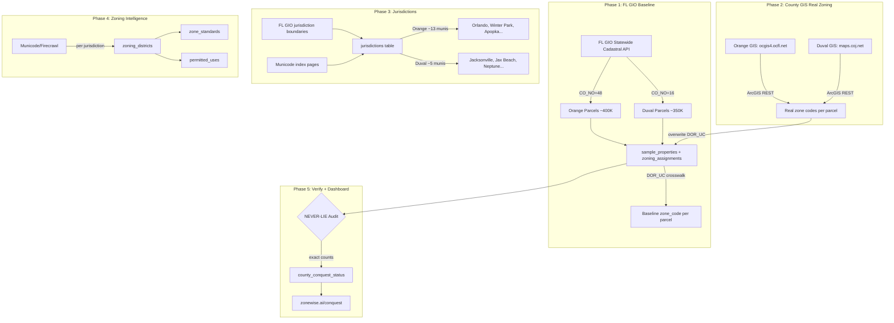

# CLAUDE.md — COUNTY EXPANSION: Orange (48) + Duval (16)

## Mission
Replicate Brevard's complete ZoneWise dataset for Orange and Duval counties.
Brevard has 351K parcels across 14 jurisdictions with zoning codes, districts, standards, and permitted uses.
Do the same for Orange (~400K parcels, 48 jurisdictions) and Duval (~350K parcels, 16 jurisdictions).

## Pipeline Architecture



## Phase Execution Plan

```mermaid
gantt
    title Orange + Duval County Expansion
    dateFormat HH:mm
    axisFormat %H:%M

    section Phase 1 - FL GIO
    Orange parcel count        :p1a, 00:00, 15m
    Orange full ingestion      :p1b, after p1a, 90m
    Duval parcel count         :p1c, after p1a, 15m
    Duval full ingestion       :p1d, after p1c, 90m

    section Phase 2 - GIS Zoning
    Discover Orange ArcGIS     :p2a, after p1b, 30m
    Scrape Orange zoning       :p2b, after p2a, 60m
    Discover Duval ArcGIS      :p2c, after p1d, 30m
    Scrape Duval zoning        :p2d, after p2c, 60m

    section Phase 3 - Jurisdictions
    Seed Orange jurisdictions  :p3a, after p2b, 20m
    Seed Duval jurisdictions   :p3b, after p2d, 20m

    section Phase 4 - Standards
    Scrape Orange ordinances   :p4a, after p3a, 60m
    Scrape Duval ordinances    :p4b, after p3b, 60m

    section Phase 5 - Verify
    NEVER-LIE audit            :p5, after p4b, 15m
```



## Phase 1: FL GIO Baseline Ingestion

```yaml
script: scripts/ingest_county.py
workflow: .github/workflows/summit-ingest-county.yml

orange:
  co_no: 48
  estimated_parcels: ~400,000
  command: python scripts/ingest_county.py --county 48 --full
  populates:
    - zoning_assignments (parcel_id, zone_code from DOR_UC, county='orange', co_no=48)
    - fl_counties row update (total_parcels, ingested_at)
    - county_conquest_status update

duval:
  co_no: 16
  estimated_parcels: ~350,000
  command: python scripts/ingest_county.py --county 16 --full
  populates: same tables with county='duval', co_no=16

rate_limit: FL GIO allows 2000 features/request, no auth needed
batch_size: 2000
estimated_time: 45-90min per county (paginated requests)
```

## Phase 2: County GIS Real Zoning Codes

```yaml
orange_gis:
  primary: https://ocgis4.ocfl.net/Html5Viewer/Index.html?viewer=InfoMap_Public_HTML5
  arcgis_rest: DISCOVER — check ocgis4.ocfl.net/arcgis/rest/services/
  appraiser: https://ocpaweb.ocpafl.org/
  orlando_gis: https://gis.orlando.gov/ (for Orlando jurisdictions specifically)
  method: |
    1. Probe ocgis4.ocfl.net/arcgis/rest/services/ for MapServer endpoints
    2. Find layer with ZONING or ZONE field
    3. Query by PARCELID matching our FL GIO parcel_ids
    4. Overwrite DOR_UC zone_code with real zoning code
    5. Set zone_source='orange_gis'

duval_gis:
  primary: https://maps.coj.net/duvalproperty/
  zoning_lookup: https://maps.coj.net/luzap/SearchZoningPublic.aspx
  arcgis_rest: DISCOVER — check maps.coj.net/arcgis/rest/services/
  jaxepics: https://jaxepics.coj.net/ (permits + property)
  method: |
    1. Probe maps.coj.net/arcgis/rest/services/ for MapServer endpoints
    2. Find zoning layer
    3. Same parcel matching + overwrite pattern
    4. Set zone_source='duval_gis'

fallback: If no ArcGIS REST endpoint found, use Firecrawl to scrape the
  HTML viewer and extract zoning per parcel. More expensive but works.
```

## Phase 3: Jurisdiction Seeding

```yaml
orange_jurisdictions:
  source: FL GIO + Wikipedia/Municode
  municipalities:
    - Orlando (largest, has own GIS)
    - Winter Park
    - Apopka
    - Ocoee
    - Winter Garden
    - Maitland
    - Eatonville
    - Belle Isle
    - Edgewood
    - Oakland
    - Windermere
    - Unincorporated Orange County
    - Bay Lake (Disney)
  total: ~13 municipalities
  insert_to: jurisdictions (name, county='Orange', state='FL', co_no=48)

duval_jurisdictions:
  source: FL GIO + Wikipedia/Municode
  municipalities:
    - Jacksonville (consolidated city-county, ~95% of parcels)
    - Jacksonville Beach
    - Neptune Beach
    - Atlantic Beach
    - Baldwin
    - Unincorporated Duval
  total: ~6 municipalities
  insert_to: jurisdictions (name, county='Duval', state='FL', co_no=16)
```

## Phase 4: Zoning Districts + Standards

```yaml
method: Firecrawl + LLM extraction (Smart Router)
per_jurisdiction:
  1. Find municode URL (library.municode.com/fl/{city})
  2. Firecrawl scrape zoning chapter
  3. LLM extract: zone codes, names, categories
  4. Insert to zoning_districts (jurisdiction_id, code, name, category)
  5. LLM extract: setbacks, height, density, lot size per zone
  6. Insert to zone_standards
  7. LLM extract: permitted/conditional uses per zone
  8. Insert to permitted_uses

cost_estimate:
  firecrawl: ~$0.50 per jurisdiction (5 pages avg)
  llm: Gemini Flash free tier for extraction
  orange_total: ~$6.50 (13 jurisdictions)
  duval_total: ~$3.00 (6 jurisdictions)
  grand_total: ~$9.50 (UNDER $10 CAP ✅)
```

## Phase 5: NEVER-LIE Verification

```yaml
audit_queries:
  - "SELECT county, COUNT(*) FROM zoning_assignments WHERE county='orange' GROUP BY county"
  - "SELECT county, COUNT(*) FROM zoning_assignments WHERE county='duval' GROUP BY county"
  - "Compare vs FL GIO official parcel counts"
  - "SELECT county, COUNT(DISTINCT zone_code) FROM zoning_assignments GROUP BY county"
  - "Report EXACT numbers — no rounding, no estimates"

update:
  - county_conquest_status: set percentages from REAL counts
  - zonewise.ai/conquest dashboard: auto-reflects

rule: WRONG = "I was wrong". Never declare victory without DB proof.
```

## Discovered Data Sources (from Exa Discovery Harness)

```yaml
orange_sources:
  appraiser:
    - https://ocpaweb.ocpafl.org/ (0.99)
    - https://orangecountypropertyappraiser.us/ (0.99)
  gis:
    - https://ocgis4.ocfl.net/Html5Viewer/Index.html (0.80)
    - https://gis.orlando.gov/ (0.78)
    - https://www.orangecountyfl.net/PlanningDevelopment/InteractiveMapping.aspx (0.63)
  zoning:
    - https://ocfl.net/PermitsLicenses/ZoningDivision.aspx (0.70)
    - https://www.orangecountyfl.net/PermitsLicenses/CodeofOrdinances.aspx (0.70)

duval_sources:
  gis:
    - https://maps.coj.net/duvalproperty/ (0.90)
    - https://maps.coj.net/luzap/SearchZoningPublic.aspx (0.90)
    - https://paopropertysearch.coj.net/ (0.90)
    - https://jaxepics.coj.net/ (0.90)
  appraiser:
    - https://www.jacksonville.gov/Departments/Property-Appraiser (0.65)
  zoning:
    - maps.coj.net/luzap/ (zoning lookup tool)
```

## Existing Scripts to Use

```yaml
reuse:
  - scripts/ingest_county.py          # Phase 1 — FL GIO ingestion (PROVEN)
  - summit-ingest-county.yml           # Phase 1 — GHA dispatch
  - DOR_UC_MAP in ingest_county.py     # Phase 1 — USE_CODE crosswalk

create:
  - scripts/discover_arcgis.py         # Phase 2 — probe ArcGIS REST endpoints
  - scripts/scrape_county_gis.py       # Phase 2 — real zoning codes from GIS
  - scripts/seed_jurisdictions.py      # Phase 3 — populate jurisdictions table
  - scripts/scrape_zoning_ordinance.py # Phase 4 — Firecrawl + LLM extraction

dependencies:
  - httpx (already in requirements)
  - Firecrawl API key (already in secrets)
  - Gemini API key (already in secrets, Smart Router FREE tier)
```

## Execution Order

```yaml
session_plan:
  step_1:
    action: "Count parcels for Orange + Duval via FL GIO"
    command: |
      python scripts/ingest_county.py --county 48
      python scripts/ingest_county.py --county 16
    time: 5min
    validates: parcel counts match expectations

  step_2:
    action: "Full ingestion Orange (CO_NO=48)"
    command: python scripts/ingest_county.py --county 48 --full
    time: 45-90min
    output: ~400K rows in zoning_assignments with DOR_UC baseline

  step_3:
    action: "Full ingestion Duval (CO_NO=16)"
    command: python scripts/ingest_county.py --county 16 --full
    time: 45-90min
    output: ~350K rows in zoning_assignments

  step_4:
    action: "Discover ArcGIS REST endpoints for both counties"
    targets:
      - https://ocgis4.ocfl.net/arcgis/rest/services/
      - https://maps.coj.net/arcgis/rest/services/
    output: Working MapServer URLs with zoning layers

  step_5:
    action: "Scrape real zoning codes from county GIS"
    method: ArcGIS REST query → match parcel_id → overwrite zone_code
    output: Real zoning codes replacing DOR_UC baseline

  step_6:
    action: "Seed jurisdictions for both counties"
    output: jurisdictions table populated for Orange + Duval

  step_7:
    action: "Scrape zoning ordinances via Firecrawl"
    output: zoning_districts + zone_standards + permitted_uses

  step_8:
    action: "NEVER-LIE audit — report exact counts"
    output: county_conquest_status updated with verified percentages

cost_budget: $10 max
estimated_cc_time: 4-6 hours autonomous
```

## Secrets Available

```yaml
SUPABASE_URL: https://mocerqjnksmhcjzxrewo.supabase.co
SUPABASE_KEY: (service role key in GitHub secrets)
SUPABASE_DB_PASSWORD: BiKvLwWTdS0PwulM (FRESH — updated all 11 repos)
DB_POOLER: aws-0-us-west-2.pooler.supabase.com
FIRECRAWL_API_KEY: in GitHub secrets
GEMINI_API_KEY: in GitHub secrets (Smart Router FREE tier)
EXA_API_KEY: in GitHub secrets
```

## NEVER-LIE Rules
- EXACT parcel counts only — query DB, never estimate
- If a GIS endpoint doesn't work, say so — don't fake data
- Report zone_source for every assignment (fl_gio | county_gis | use_code_crosswalk | firecrawl)
- County conquest % = (parcels_with_zoning / total_parcels) × 100 — from DB, never invented
