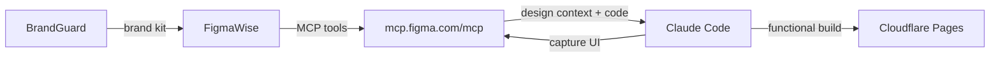

# FIGMA-MCP-SPEC: FigmaWise Agent — Figma MCP Integration

## Status: READY FOR DEPLOYMENT
## Author: Claude AI Architect
## Date: 2026-03-25
## Target Repo: breverdbidder/cli-anything-biddeed

---

## Solution

Integrate Figma's official remote MCP server into Claude Code on Hetzner.
Figma MCP enables: read designs, extract tokens, get code, write to canvas, capture live UI.

## Auth

```yaml
method: OAuth (one-time browser flow)
setup: claude plugin install figma@claude-plugins-official
endpoint: https://mcp.figma.com/mcp
token_persistence: ~/.claude/ (survives sessions)
human_touch: ONE click on Telegram OAuth link, then zero HITL forever
```

## Architecture



## MCP Config for Claude Code

```json
{
  "mcpServers": {
    "figma": {
      "type": "url",
      "url": "https://mcp.figma.com/mcp"
    }
  }
}
```

## Available Figma MCP Tools

```yaml
tools:
  read:
    - get_file_context: Extract design context from Figma frame/component
    - get_code_connect_map: Map Figma nodes to code components
    - get_variables_and_styles: Colors, spacing, typography from selection
    - get_figjam_content: Access FigJam diagrams
  write:
    - create_figma_content: Create/modify frames, components, variables
    - capture_ui_to_figma: Send live UI as design layers to Figma
  skills:
    - implement_design: Turn Figma frame into code (React+Tailwind default)
    - code_connect: Reuse actual components from codebase
    - create_design_system_rules: Design system enforcement
```

## Pipeline: Design-to-Code

```yaml
stages:
  1_design_extract:
    input: Figma file URL
    tool: get_file_context
    output: design tokens, layout, colors, typography

  2_brand_validate:
    agent: BrandGuard
    check: navy=#1E3A5F, orange=#F59E0B, Inter font
    gate: brand compliance

  3_code_generate:
    agent: Claude Code
    input: design context + brand validation
    tool: implement_design
    output: React + Tailwind component

  4_capture_back:
    tool: capture_ui_to_figma
    action: Send built UI back to Figma for designer review
```

## Pipeline: Code-to-Design (Reverse)

```yaml
stages:
  1_build: Claude Code builds component
  2_serve: Start local dev server
  3_capture: capture_ui_to_figma sends to Figma file
  4_iterate: Designer refines in Figma, Claude pulls updated context
```

## Rate Limits

```yaml
free_tier: 6 tool calls/month (Starter plan)
paid_tier: Per-minute limits matching Figma REST API Tier 1
current_plan: CHECK — may need Dev seat for production use
beta_note: Write-to-canvas is free during beta, will become paid
```

## Cost

```yaml
figma_mcp: FREE (beta)
figma_plan: Existing plan (check seat type)
new_secrets: ZERO (OAuth token, not API key)
```

## OAuth Setup (One-Time)

```yaml
setup_steps:
  1: Claude Code on Hetzner runs: claude plugin install figma@claude-plugins-official
  2: Plugin generates OAuth URL
  3: URL sent to Ariel via Telegram
  4: Ariel clicks link, clicks "Allow access" in browser
  5: Token stored in ~/.claude/ on Hetzner
  6: DONE — zero HITL from here forward
```
