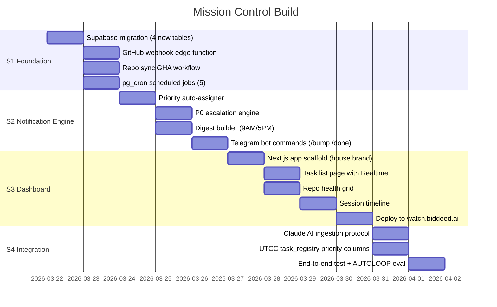

# Mission Control — Sprint Plan
## Claude Code Handoff Document

**Spec:** MISSION-CONTROL-SPEC.md
**Repo:** breverdbidder/cli-anything-biddeed
**Harness:** harnesses/watch/ (expand existing Claude Watch)
**Dashboard:** watch.biddeed.ai (Vercel Pro)

---

## Sprint Structure



---

## S1 — Foundation (Est: 30 min Claude Code)

### S1.1 Supabase Migration
```yaml
file: harnesses/watch/migrations/002_mission_control.sql
tables:
  - repo_status (as defined in spec)
  - chat_sessions (as defined in spec)
  - notifications_log (as defined in spec)
  - ALTER task_registry ADD COLUMN priority TEXT DEFAULT 'P2'
  - ALTER task_registry ADD COLUMN project TEXT
  - ALTER task_registry ADD COLUMN owner TEXT DEFAULT 'Claude Code'
  - ALTER task_registry ADD COLUMN sla_deadline TIMESTAMPTZ
  - ALTER task_registry ADD COLUMN escalation_count INT DEFAULT 0
  - ALTER task_registry ADD COLUMN last_escalated_at TIMESTAMPTZ
  - ALTER task_registry ADD COLUMN source_chat_id TEXT
  - ALTER task_registry ADD COLUMN auto_priority BOOLEAN DEFAULT true
  - ADD CHECK (priority IN ('P0','P1','P2','P3'))
run_via: Supabase REST API using SUPABASE_KEY secret
verify: SELECT count(*) FROM each new table
```

### S1.2 Seed repo_status
```yaml
file: harnesses/watch/scripts/seed_repos.py
action: |
  GitHub API → fetch all breverdbidder repos
  Classify into tiers (core/active/monitored per spec)
  INSERT INTO repo_status for each repo
  Compute initial stale_days and health_score
verify: SELECT count(*) FROM repo_status = 50
```

### S1.3 GitHub Webhook Edge Function
```yaml
file: supabase/functions/gh-webhook/index.ts
triggers_on: push, pull_request, workflow_run, issues
action: |
  Validate webhook signature (GITHUB_WEBHOOK_SECRET)
  Parse event type
  UPDATE repo_status: last_push_at, last_ci_status, open_prs, open_issues
  IF ci_failure AND tier='core': INSERT notification → Telegram
verify: curl POST to edge function with sample payload
```

### S1.4 pg_cron Jobs
```yaml
file: harnesses/watch/migrations/003_cron_jobs.sql
jobs:
  - mc_staleness_scan: every 5 min
  - mc_p0_escalation: every 2 hours
  - mc_morning_digest: 14:00 UTC (9 AM EST)
  - mc_evening_digest: 22:00 UTC (5 PM EST)
  - mc_repo_sync: every 6 hours
```

### S1.5 Repo Sync Workflow
```yaml
file: .github/workflows/mc-repo-sync.yml
schedule: "0 */6 * * *"
action: |
  Fetch all repos via GitHub API
  Upsert repo_status
  Detect new repos → add as monitored tier
  Flag stale repos
```

---

## S2 — Notification Engine (Est: 30 min Claude Code)

### S2.1 Priority Auto-Assigner
```yaml
file: harnesses/watch/mc/priority_engine.py
rules: (from spec auto_priority_rules)
input: task dict
output: priority string (P0-P3) + sla_deadline
tests: 15 assertions covering each rule
```

### S2.2 P0 Escalation Engine
```yaml
file: harnesses/watch/mc/escalation.py
action: |
  Query P0 tasks past 2hr SLA
  For each:
    IF escalation_count == 0: send "🔴 P0 REMINDER" via Telegram
    IF escalation_count >= 2: send "⚠️ ACCOUNTABILITY" alert
    INCREMENT escalation_count, SET last_escalated_at
  Log to notifications_log
trigger: pg_cron OR edge function invoked by cron
```

### S2.3 Digest Builder
```yaml
file: harnesses/watch/mc/digest.py
sections:
  - "🔴 P0 CRITICAL" — unresolved P0 items (always first)
  - "📊 Completed since last digest" — count + list
  - "🟠 P1 needing attention" — items past 12hr
  - "🟡 P2 stale items" — past 72hr
  - "📦 Repo health" — any CI failures, stale core repos
  - "📈 Stats" — tasks created/completed/blocked today
format: Telegram HTML message, max 4096 chars
trigger: pg_cron at 9AM + 5PM EST
```

### S2.4 Telegram Bot Commands
```yaml
file: Update claude-code-telegram-control/bot_v4.py
new_commands:
  /bump <id>: UPDATE priority = prev_level, auto_priority=false
  /demote <id>: UPDATE priority = next_level, auto_priority=false
  /done <id>: UPDATE status='success', completed_at=NOW()
  /skip <id>: UPDATE status='cancelled'
  /tasks: SELECT * WHERE status IN (queued,running,dispatched,blocked) ORDER BY priority
  /p0: SELECT * WHERE priority='P0' AND status NOT IN (success,cancelled)
  /stale: SELECT * WHERE sla_deadline < NOW() AND status NOT IN (success,cancelled)
  /digest: Trigger immediate digest build + send
tests: 8 command tests
```

---

## S3 — Dashboard (Est: 45 min Claude Code)

### S3.1 Next.js App Scaffold
```yaml
location: harnesses/watch/dashboard/ OR separate Vercel project
framework: Next.js 14 App Router
styling: Tailwind + house brand tokens
auth: None (internal tool, Vercel password protection)
realtime: @supabase/supabase-js Realtime subscription
pages: /, /repos, /sessions, /notifications, /settings
```

### S3.2 Command Center Home (/)
```yaml
components:
  PriorityStrip: P0/P1/P2/P3 count cards with real-time updates
  TaskTable: Sortable/filterable by project, owner, priority, status
  ArielActionBox: Highlighted callout for owner=Ariel items
  LiveIndicator: Green dot when Realtime connected
features:
  - Click task → expand detail panel
  - Inline status update (done/skip/bump)
  - Auto-refresh via Supabase Realtime
```

### S3.3 Repo Health Grid (/repos)
```yaml
components:
  RepoCard: name, tier badge, last push, CI status, health score bar
  TierSection: Collapsible sections for core/active/monitored
  StaleHighlight: Red border on stale repos
features:
  - Click repo → GitHub link
  - Sort by health score, last push, name
  - Tier filter
```

### S3.4 Session Timeline (/sessions)
```yaml
components:
  SessionCard: title, source badge, timestamp, task counts, key decisions
  Timeline: Vertical timeline with date separators
features:
  - Filter by source (claude_ai, claude_code, telegram)
  - Click → expand full summary + linked tasks
```

### S3.5 Deploy
```yaml
domain: watch.biddeed.ai
vercel_project: Existing or new under Vercel Pro
env_vars: NEXT_PUBLIC_SUPABASE_URL, NEXT_PUBLIC_SUPABASE_ANON_KEY
password_protection: Vercel deployment protection (Ariel only)
```

---

## S4 — Integration (Est: 20 min Claude Code)

### S4.1 Claude AI Ingestion Helper
```yaml
file: harnesses/watch/mc/ingest.py
functions:
  push_task(task_dict): POST to task_registry via REST
  push_session(session_dict): POST to chat_sessions via REST
  push_batch(tasks_list): Bulk upsert with ON CONFLICT
exports: Shell commands for Claude AI to call via bash_tool
```

### S4.2 UTCC Integration
```yaml
action: |
  Update UTCC registry.py to call priority_engine on task create
  Update UTCC notifier.py to use notification routing from spec
  Wire utcc-executor-ssh.yml completion → task_registry status update
```

### S4.3 AUTOLOOP Eval
```yaml
file: harnesses/watch/eval/eval.json
assertions: 25
categories:
  - Migration: tables exist, columns correct (5)
  - Repo sync: 50 repos loaded, tiers correct (5)
  - Priority engine: auto-assign rules correct (5)
  - Notifications: P0 escalation fires, digest builds (5)
  - Dashboard: pages render, Realtime connects (5)
```

---

## Commit Rules

```yaml
git:
  email: ci@biddeed.ai
  name: BidDeed-CI
  prefix: "MC:"
  push: main after each sprint
  telegram: Notify on each sprint completion
```

---

## Success Criteria

```yaml
done_when:
  - 4 new Supabase tables created and seeded
  - 50 repos tracked in repo_status with correct tiers
  - P0 escalation fires every 2hr (verified via test)
  - Digest sends at 9AM + 5PM EST (pg_cron registered)
  - /bump /done /tasks /p0 commands work in Telegram
  - watch.biddeed.ai loads with real data from Supabase
  - Realtime updates flow when task_registry changes
  - AUTOLOOP eval scores >= 80%
```
