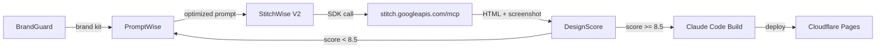

# STITCH-AGENT-SPEC: StitchWise V2 — Programmatic Stitch Integration

## Status: READY FOR DEPLOYMENT
## Author: Claude AI Architect
## Date: 2026-03-25
## Target Repo: breverdbidder/cli-anything-biddeed

---

## Problem

DesignWise Squad uses local stitch-skills (Apache-2.0) but does NOT interact with Google Stitch's hosted platform. This means:
- No access to Stitch's Gemini-powered generation (higher quality than local)
- No visual preview/iteration loop
- No "Code to Clipboard" export pipeline
- Missing the Stitch → Claude Code workflow that's becoming industry standard

## Solution

Replace Claude-in-Chrome approach with **direct Stitch SDK + MCP integration**. Google ships:
1. `@google/stitch-sdk` — TypeScript SDK (generate screens, get HTML/screenshots)
2. Stitch MCP Server — Claude Code can call Stitch tools natively
3. API Key auth — no OAuth, just generate key in Stitch Settings

## Architecture



## Pipeline Stages

```yaml
stages:
  1_brand_load:
    agent: BrandGuard
    input: BRAND_COLORS.md (navy #1E3A5F, orange #F59E0B, Inter)
    output: brand_kit.json

  2_prompt_optimize:
    agent: PromptWise
    input: user_request + brand_kit.json
    action: Claude generates Gemini-optimized prompt for Stitch
    output: stitch_prompt.txt

  3_stitch_generate:
    agent: StitchWise V2
    tool: "@google/stitch-sdk"
    actions:
      - create_project (if new)
      - generate screen from stitch_prompt.txt
      - getHtml() → screen.html
      - getImage() → screen.png
    output: screen.html + screen.png
    circuit_breaker: max 3 generations per design (350/mo limit)

  4_design_score:
    agent: DesignScore
    input: screen.html + screen.png + brand_kit.json
    checks:
      - brand color compliance
      - mobile responsiveness
      - accessibility (contrast, alt text)
      - animation quality
    output: score (0-10)
    gate: score >= 8.5 → proceed, else → back to stage 2

  5_export_build:
    agent: Claude Code
    input: screen.html (Stitch export)
    action: Build functional React/Next.js from Stitch HTML
    output: deployable app
    deploy: Cloudflare Pages
```

## MCP Config for Claude Code

```json
{
  "mcpServers": {
    "stitch": {
      "command": "npx",
      "args": ["-y", "@_davideast/stitch-mcp", "proxy"],
      "env": {
        "GEMINI_API_KEY": "${GEMINI_API_KEY}"
      }
    }
  }
}
```

## SDK Usage (StitchWise V2 Core)

```typescript
import { stitch } from "@google/stitch-sdk";

// Create project with brand context
const result = await stitch.callTool("create_project", {
  title: "BidDeed Dashboard"
});

// Generate screen from optimized prompt
const project = stitch.project(projectId);
const screen = await project.generate(stitchPrompt);

// Extract artifacts
const html = await screen.getHtml();     // Download URL for HTML
const image = await screen.getImage();   // Download URL for screenshot
```

## Cost & Limits

```yaml
cost:
  stitch_api: FREE
  stitch_generations: 350/month (free tier)
  circuit_breaker: 3 attempts per design = ~116 designs/month max
  sdk_package: FREE (Apache-2.0)

guardrails:
  max_retries_per_design: 3
  monthly_generation_budget: 300 (reserve 50 for manual)
  alert_at: 250 generations
  telegram_notify: true
```

## Secrets Required

```yaml
secrets:
  GEMINI_API_KEY:
    source: stitch.withgoogle.com → Settings → API Keys → Create Key
    store: GitHub repo secret + Hetzner env
    status: PENDING — Ariel must generate this
```

## Summit Dispatch

```yaml
dispatch:
  target: cli-anything-biddeed
  branch: feat/stitch-agent-v2
  tasks:
    - npm install @google/stitch-sdk
    - Create src/agents/stitchwise_v2.ts
    - Add MCP config to .claude/settings.json
    - Add GEMINI_API_KEY to repo secrets
    - Create eval/stitch/eval.json (25 assertions)
    - Update CLAUDE.md with Stitch pipeline
    - Run eval_runner.py
```

## ONE Blocker (Ariel Required)

**Generate GEMINI_API_KEY:**
**No new key needed.** Uses existing GEMINI_API_KEY from GitHub secrets (same GCP project).
Only step: ensure Stitch API is enabled on the project:
```
gcloud beta services mcp enable stitch.googleapis.com --project=<PROJECT_ID>
```
If already enabled (likely), zero human action required.
