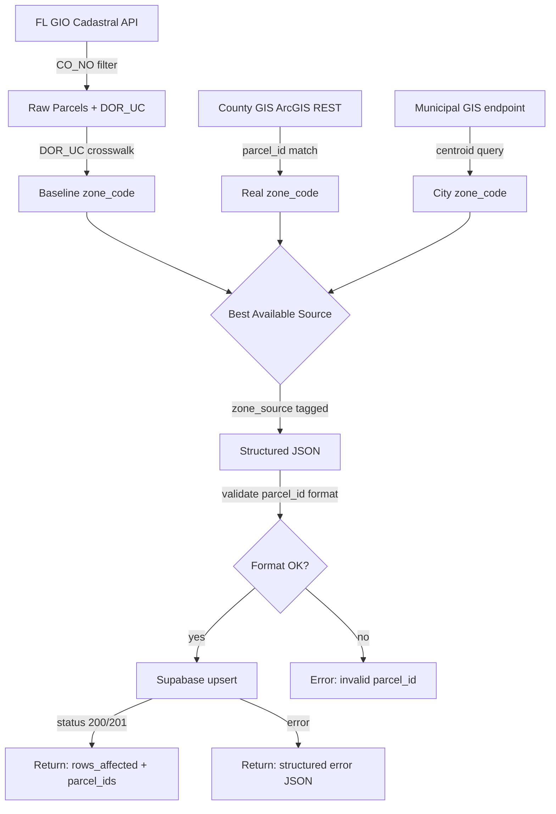

# ZONEWISE.md — Project-Specific Analysis & SOP

Own county zoning conquest as evidence-driven parcel coverage, not aspirational claims.

## Working Mode

1. **Map**: Identify target county, available GIS endpoints, and parcel count from FL GIO
2. **Separate evidence from hypothesis**: Query actual data sources before claiming coverage percentages
3. **Smallest intervention**: Use existing DOR_UC crosswalk as baseline, overlay municipal GIS only where available
4. **Validate**: Run eval assertions against every output — 25/25 binary pass required

## Confidence Labels

Every claim in output MUST carry one of:
- **CONFIRMED**: Backed by DB query result, GIS API response, or eval pass
- **HYPOTHESIS**: Inferred from patterns but not directly verified against live data
- **UNKNOWN**: Cannot determine — requires runtime check or manual verification

## Focus Areas

1. **Parcel ID format integrity** — every county has a distinct parcel ID regex; never mix formats across counties
2. **Zone source provenance** — track whether zone_code came from FL GIO DOR_UC, county GIS, or municipal GIS
3. **Municipal vs county boundary** — USE_CODE is fallback only; prefer native municipal zoning when GIS endpoint exists
4. **Match rate threshold** — spatial joins below 95% indicate data quality issues requiring investigation
5. **Supabase idempotency** — upsert on parcel_id to avoid duplicates; verify row count matches input
6. **Error structure** — invalid inputs return structured JSON with error codes, never raw tracebacks
7. **Multi-county scalability** — pipeline must handle 67 FL counties; batch size 2000 per FL GIO request
8. **NEVER-LIE audit** — all parcel counts and percentages come from DB queries, never estimates

## Architecture Summary

ZoneWise is a multi-county zoning data scraper that collects, parses, and structures
zoning ordinance data from Florida county websites. Unlike GUI targets, ZoneWise
operates as a data pipeline: scrape HTML → parse zoning codes → structure JSON → persist to Supabase.

```
┌────────────────────────────────────────────────┐
│              County Websites (67 FL)            │
│  ┌──────────┐ ┌──────────┐ ┌──────────────┐    │
│  │ Brevard  │ │  Miami   │ │  Orange      │    │
│  │ County   │ │  -Dade   │ │  County      │ …  │
│  └────┬─────┘ └────┬─────┘ └────┬─────────┘    │
└───────┼────────────┼────────────┼───────────────┘
        │            │            │
   ┌────┴────────────┴────────────┴────────┐
   │         Tiered Scraping Pipeline       │
   │  Tier1: Firecrawl → Markdown           │
   │  Tier2: Gemini Flash → Structured JSON │
   │  Tier3: Claude Sonnet → Complex Zoning │
   │  Tier4: Manual Flag                    │
   └────────────────────┬──────────────────┘
                        │
   ┌────────────────────┴──────────────────┐
   │         cli-anything-zonewise          │
   │  Click CLI + REPL + --json output      │
   │  --persist → Supabase                  │
   └────────────────────────────────────────┘
```

## Supabase Schema Reference

### zoning_assignments (primary table)
| Column | Type | Constraint |
|--------|------|-----------|
| parcel_id | text | PRIMARY KEY |
| zone_code | text | NOT NULL |
| zone_name | text | |
| zone_description | text | |
| category | text | |
| county | text | NOT NULL, lowercase |
| co_no | integer | FL county number |
| zone_source | text | fl_gio / county_gis / municipal_gis / use_code_crosswalk |
| created_at | timestamptz | DEFAULT now() |
| updated_at | timestamptz | DEFAULT now() |

**Upsert strategy**: `ON CONFLICT (parcel_id) DO UPDATE SET zone_code, zone_name, zone_source, updated_at = now()`.
This ensures idempotent writes — re-running a scrape overwrites with latest data, never duplicates.

## Backend Strategy: HTTP API Client

ZoneWise has no local GUI software. The "backends" are:

1. **Firecrawl** — Web scraping API ($83/mo). Converts county websites to clean markdown.
2. **Gemini Flash** — Google's free-tier LLM. Parses markdown into structured JSON zoning records.
3. **Claude Sonnet** — Complex zoning interpretation (Free on Max plan).
4. **Supabase** — Persistence layer for all zoning data.

## Data Model

### County Record
```json
{
  "county": "brevard",
  "state": "FL",
  "last_scraped": "2026-03-11T04:00:00Z",
  "parcels_total": 1247,
  "status": "complete"
}
```

### Zoning Record
```json
{
  "county": "brevard",
  "zone_code": "RS-1",
  "zone_name": "Single Family Residential",
  "category": "residential",
  "min_lot_size_sqft": 7500,
  "max_height_ft": 35,
  "setbacks": {"front": 25, "rear": 20, "side": 7.5},
  "allowed_uses": ["single_family", "home_office"],
  "source_url": "https://..."
}
```

## County Parcel ID Formats

Each county uses a specific parcel ID format. Validate before persisting:

| County | Format | Regex | Example |
|--------|--------|-------|---------|
| Brevard | `##-##-##-##-#####.#-####.#` | `^\d{2}-\d{2}-\d{2}-\d{2}-\d{5}\.\d-\d{4}\.\d$` | `25-36-28-00-00001.0-0001.0` |
| Orange | `##-##-##-####-##-###` | `^\d{2}-\d{2}-\d{2}-\d{4}-\d{2}-\d{3}$` | `09-23-28-0000-00-001` |
| Duval | `######-####` | `^\d{6}-\d{4}$` | `123456-0001` |

## Command Map

| Agent Action | CLI Command |
|-------------|-------------|
| Scrape a county | `county scrape --county brevard` |
| List counties | `county list --state FL` |
| Check scrape status | `county status --county brevard` |
| Look up single parcel | `parcel lookup --address "123 Main St"` |
| Batch parcel lookup | `parcel batch --input parcels.csv` |
| Export to Supabase | `export supabase --county brevard` |
| Export CSV | `export csv --county brevard -o data.csv` |
| Spatial join | `spatial join --county brevard --method STRtree` |
| Municipal conquest | `municipal conquest --city "Palm Bay" --gis-url <url>` |

## Brevard Zone Code Registry

Valid zone_code prefixes for Brevard County (CO_NO=5):

| Prefix | Name | Category |
|--------|------|----------|
| AU | Agricultural Use | agricultural |
| BU | Business Use | commercial |
| GU | General Use | general |
| IU | Industrial Use | industrial |
| MHPD | Mobile Home Park District | residential |
| PA | Professional Activities | commercial |
| PIP | Planned Industrial Park | industrial |
| PUD | Planned Unit Development | planned |
| RR | Rural Residential | residential |
| RS | Single Family Residential | residential |
| RU | Residential Urban | residential |
| RVP | Recreational Vehicle Park | commercial |
| SEU | Suburban Estate Use | residential |
| TR | Transitional | general |
| TU | Tourist Use | commercial |

## Municipal GIS Endpoints (Brevard)

| Municipality | GIS URL | Zoning Layer |
|-------------|---------|--------------|
| Palm Bay | `gis.palmbayflorida.org` | `Zoning/MapServer/0` |
| Melbourne | `gis.melbourneflorida.org` | `Zoning/MapServer/0` |
| Cocoa | `maps.cocoafl.org` | TBD |
| Titusville | `gis.titusville.com` | TBD |
| Rockledge | TBD | TBD |

## DOR_UC Crosswalk (FL GIO Fallback)

When no county/municipal GIS provides native zoning, use FL GIO's DOR Use Code as baseline:

| DOR_UC Range | Category | Zone Fallback |
|-------------|----------|---------------|
| 00-09 | Residential | RS (default) |
| 10-19 | Commercial | BU (default) |
| 20-29 | Industrial | IU (default) |
| 30-39 | Agricultural | AU (default) |
| 40-49 | Institutional | GU (default) |
| 50-69 | Government | GU (default) |
| 70-79 | Miscellaneous | TR (default) |
| 80-89 | Centrally Assessed | GU (default) |
| 90-99 | Non-agricultural Acreage | RR (default) |

**Priority**: Municipal GIS > County GIS > DOR_UC crosswalk. Always set `zone_source` to reflect actual provenance.

## Output Schemas

All outputs MUST be valid JSON. Every response — including errors — MUST be parseable JSON.

### Parcel Scrape Output (Array)
Each record in the array MUST contain:
- `parcel_id`: String matching Brevard format `##-##-##-##-#####.#-####.#` (e.g. `25-36-28-00-00001.0-0001.0`)
- `zone_code`: Non-null string using Brevard prefixes: BU, GU, RS, RU, AU, IU, PUD, PIP, TU, SEU, RR, PA, MHPD, RVP, TR
- `zone_name`: Non-null string (human-readable zone description)
- `category`: One of: residential, commercial, industrial, agricultural, general, planned
- `county`: Lowercase county name (e.g. `"brevard"`)

### Spatial Join Output (Object)
```json
{
  "total_parcels": 351247,        // integer > 0
  "matched_parcels": 340710,      // integer > 0
  "match_rate": 0.97,             // matched/total >= 0.95
  "unmatched_parcels": [],        // array (may be empty)
  "processing_time_seconds": 42.7 // numeric value
}
```

### Municipal Conquest Output (Object)
```json
{
  "municipality": "Palm Bay",                    // exact municipality name
  "gis_source": "https://gis.palmbayflorida.org/...", // must contain municipality GIS domain
  "zone_source": "municipal_gis",                // NEVER "USE_CODE" — use native zoning
  "matched_parcels": 78432,                      // integer (Palm Bay: >50000)
  "zone_code": "RS-1",                           // non-null
  "zone_description": "Single Family Residential" // non-null
}
```

### Supabase Persist Output (Object)
```json
{
  "status_code": 201,             // 200 or 201
  "rows_affected": 10,            // must match input count
  "parcel_ids": ["..."],          // unique array, no duplicates
  "created_at": "2026-04-10T07:30:00Z", // ISO 8601 timestamp
  "county": "brevard"             // lowercase string
}
```

### Error Output (Object)
On invalid input (e.g. non-existent county), return structured error — never raw tracebacks:
```json
{
  "error": "County 'Fakeland' not found in FL county registry.",
  "exit_code": 1,                 // non-zero (1 or 2)
  "county_requested": "Fakeland"  // no null top-level fields
}
```

## Error Codes

| exit_code | Meaning | Example |
|-----------|---------|---------|
| 0 | Success | All parcels scraped and persisted |
| 1 | Fatal error | Invalid county, network failure, auth error |
| 2 | Partial success | Some parcels failed, others succeeded |

Error responses MUST always include:
- `error`: Human-readable message (no tracebacks)
- `exit_code`: Integer (1 or 2)
- No null values in any top-level field

## Batch Processing

FL GIO API limit: 2000 features per request. For full county ingestion:
- Use `resultOffset` pagination: 0, 2000, 4000, ...
- Continue until `exceededTransferLimit` is false
- Estimated times: Brevard (~351K) = 45-90min, Orange (~400K) = 60-120min

## Quality Gates

```yaml
gate_1: "Every output MUST be valid JSON — parseable without errors"
gate_2: "Every parcel_id MUST match county-specific format regex"
gate_3: "zone_source MUST reflect actual data provenance — never USE_CODE for municipal conquests"
gate_4: "Error states MUST return structured JSON with exit_code != 0"
gate_5: "Match rate for spatial joins MUST be >= 95% or flag as degraded"
```

## Data Flow



## Return Contract

Every ZoneWise operation MUST return results in this structure:
1. **Scope**: County/municipality targeted, number of parcels expected
2. **Finding + Evidence**: Actual data retrieved with source attribution (zone_source field)
3. **Intervention**: What was written/updated (table, row count, upsert result)
4. **Validated**: Eval assertion results — 25/25 binary pass/fail
5. **Residual**: Unmatched parcels, degraded match rates, or known gaps to address next

## Guard Rails

```yaml
guard_rails:
  - "Do not output raw Python tracebacks — always wrap in structured JSON error"
  - "Do not use USE_CODE mapping when municipal GIS provides native zoning codes"
  - "Do not claim parcel counts without querying the actual data source"
```
